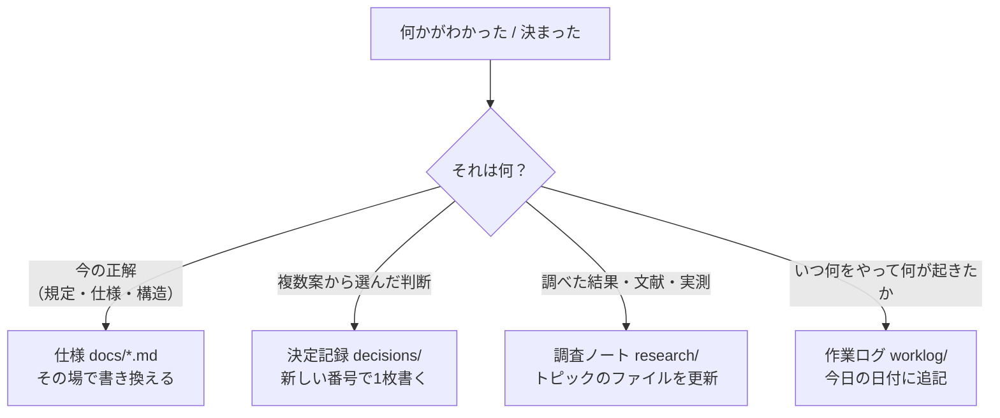

# docs — 2027年度武満徹作曲賞のための作曲システム

このディレクトリは、プロジェクトの設計・決定・調査・作業記録を置く場所。
**まずここを読んでから他のファイルに進む。**

**最初に読むのは [`proposal.md`](./proposal.md)。** 単体で全体像が分かるように書いてある。

---

## 文書の地図

| ファイル | 種別 | 何が書いてあるか |
| --- | --- | --- |
| [`proposal.md`](./proposal.md) | 提案 | **全体像・作曲行為の定義・AIとの境界・システム構成・開発のステップ。単体で読める** |
| [`competition.md`](./competition.md) | 仕様 | 応募規定。**動かせない外形条件** |
| [`open-questions.md`](./open-questions.md) | 仕様 | **未決事項の一覧。相談の目次** |
| [`glossary.md`](./glossary.md) | 仕様 | 用語の統一表 |
| [`decisions/`](./decisions/) | 決定記録 | 1決定1ファイル。なぜそう決めたか。索引は [`decisions/README.md`](./decisions/README.md) |
| [`research/`](./research/) | 調査ノート | 調べてわかったこと。出典つき。索引は [`research/README.md`](./research/README.md) |
| [`worklog/`](./worklog/) | 作業ログ | 日付順の追記。やったこと・観測・失敗 |

設計が固まってから作るファイル: `architecture.md`（採用した構成の仕様）、
`model.md`（データモデルの仕様）、`performance-map.md`（演奏マップの仕様）。
**中身のない器を先に作らない。**

`proposal.md` は提案が採択されるにつれて仕様ファイルへ分解されていく。

---

## 4種類の文書と、その扱い方

文書を性質で4つに分ける。**性質が違えば更新の仕方も違う**ので、混ぜない。
この分け方の理由は [`decisions/0001-document-rules.md`](./decisions/0001-document-rules.md)。

### 1. 仕様（live document）

`docs/*.md` のトップレベル。**常に「現在の正解」だけを書く。**

- 経緯・過去の案・変更履歴を**書かない**。それは git と決定記録が持つ
- 「以前は」「現在は」「〜に変更した」のような**時制・変化を表す表現を使わない**
- 内容が変わったら古い記述を**消して**書き換える。追記して両論併記にしない
- **未決のものは [`open-questions.md`](./open-questions.md) に集約する**

### 2. 決定記録 / ADR（書いたら変えない）

`docs/decisions/NNNN-slug.md`。**1つの決定につき1ファイル。**

- 書式と運用は [`decisions/README.md`](./decisions/README.md)
- 一度書いた本文は原則書き換えない。覆すときは**新しい決定記録を書き**、
  古い方の状態を `差し替え済み` にして新しい番号へのリンクだけ足す
- 状態は `提案` / `採用` / `棄却` / `差し替え済み`。合意前の案も `提案` として置いてよい
- 「なぜこうしたか」は全部ここに集める

### 3. 調査ノート（トピック単位の live document）

`docs/research/<topic>.md`。

- **出典を必ず書く。** 文献・URL・実測ログのいずれか
- 事実と解釈を混ぜない。確度を明示する:

  | 記号 | 意味 |
  | --- | --- |
  | `[文献]` | 出典がある。出典が**言っていること**だけ |
  | `[実測]` | 自分で測った、実機で確認した |
  | `[導出]` | 上のどれかからの計算。検算できる |
  | `[推測]` | 根拠のない見込み。潰す対象 |

- **文献の上に載せた自分の推論は `[文献]` ではない。**
  出典に書かれていないことは `[推測]`
- 索引と未着手の調査キューは [`research/README.md`](./research/README.md)

### 4. 作業ログ（追記のみ）

`docs/worklog/YYYY-MM-DD.md`。

- **過去の記述を書き換えない。** 間違いに気づいたら、新しい日付で訂正を書く
- 書くこと: やったこと / 観測した結果 / 失敗したこと / 判断に迷った点 / 次の一手
- **失敗を消さない**

---

## 迷ったときの振り分け

| 書きたいこと | 行き先 |
| --- | --- |
| 「打楽器は4奏者まで」 | `competition.md` |
| 「ジェスチャーをプリミティブにする。理由は〜」 | `decisions/` |
| 「配器の層はこうしたらどうか、と Claude が思っている」 | `open-questions.md` の「僕の見立て」 |
| 「Sibelius はこの要素を取り込まなかった」 | `research/` |
| 「今日この配器を鳴らしたら厚すぎた」 | `worklog/` |

### 正本は1箇所に置く

同じ事実が複数の場所に現れてもよいが、**数値と主張の正本は必ず1箇所**にして、
他からはリンクする。**引用ではなくリンクにする。**

写した瞬間に、写した先は古くなりうる。とくに応募規定は**間違えると失格に直結する**ので、
[`competition.md`](./competition.md) を唯一の正本とし、他所には数値を写さない。

### 合意していないことを、決まったこととして書かない

このプロジェクトは相談しながら決める部分が大きい。
とくに音楽的な判断（奏法の語彙、編成、形式）は一方的に決めるものではない。

- 合意していない案を、**決まったことのように**書かない
- 行き先は [`open-questions.md`](./open-questions.md) の「僕の見立て」か、
  `decisions/` に状態 `提案` として置く
- **音についての判断には、必ず実際に鳴る音を添える。** 言葉だけで音を決めない

---

## 音とデータの置き場所

文書には大きなバイナリを置かない。

| 種類 | 置き場所 |
| --- | --- |
| レンダリングしたオーディオ、生成した MusicXML、書き出した PDF | `artifacts/`（git 管理外。作業ログから参照する） |
| オーケストラ音源のサンプル本体 | **リポジトリの外** |
| 確定した演奏マップ | `presets/` |

**オーディオファイルはリポジトリに入れない。**

聴かないと判断できない結果は、作業ログに「どの音を聴いてどう感じたか」を言葉で残す。
音そのものが消えても判断の根拠が残るようにする。
