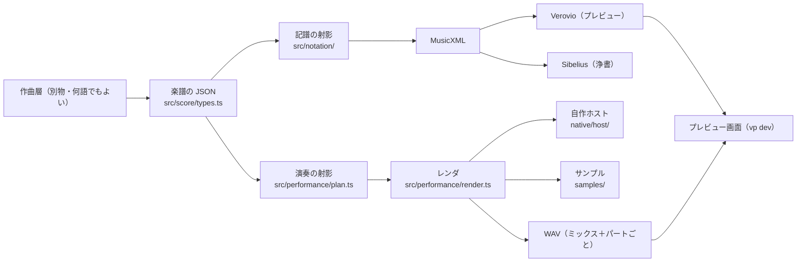

# 構成 — 鳴らす仕組みと見せる仕組み

作曲層から独立した土台の、今の構成。決めた理由は各決定記録にある。



## 楽譜の JSON（作曲層との唯一の契約）

型と説明は [`../src/score/types.ts`](../src/score/types.ts)、見本は [`../examples/showcase.json`](../examples/showcase.json)。
決めた理由は [`decisions/0014`](./decisions/0014-score-json-contract.md)。

| 項目 | 表し方 |
| --- | --- |
| 時間 | 四分音符単位。数か `[分子, 分母]` の分数（例: 3連8分 = `[1, 3]`） |
| 音高 | 実音。`"E+4"`（四分音上げ）、`"B-3"`（四分音下げ）、`{ "midi": 64.5 }`、`{ "step", "alter", "octave" }`。四分音の格子のみ |
| 強弱 | 連続値。0 = niente、1 = ppp … 5 = mf … 8 = fff。パートの曲線（`dynamics`、`to: "linear"` で線形に移る）と音符の `dynamic` |
| 奏法 | 楽器ごとの語彙（[`../src/instruments/catalog.ts`](../src/instruments/catalog.ts)）。組み合わせは `+`（`"tremolo+sul-pont"`） |
| ディヴィジ | パートが `players`（そのセクションの何人か）を持つ（[`decisions/0015`](./decisions/0015-divisi-first-class.md)） |

## 記譜の射影

[`../src/notation/`](../src/notation/)。楽譜の JSON → MusicXML 4.0。

- 小節線と拍で分割してタイでつなぐ。拍の中に奇数の分割があれば、その拍全体を連符にする
- 強弱の曲線から、記号（ppp〜fff、n）とヘアピン（niente を含む）を導く
- 奏法が変わるところに文字を置く（pizz. → arco、sul pont. → ord. など）。トレモロ、フラッター、ロールは符尾の斜線
- 臨時記号は小節内の規則で計算して `<accidental>` に書く。四分音は小数の `<alter>`（[`decisions/0011`](./decisions/0011-quarter-tone-notation.md)）
- 総譜は実音（in C、[`decisions/0017`](./decisions/0017-score-in-c.md)）。ピッコロ、コントラバス、グロッケンなどはオクターヴ記譜

## 演奏の射影とレンダ

[`../src/performance/`](../src/performance/)、BBC SO の対応表は [`../src/libraries/bbcso/map.ts`](../src/libraries/bbcso/map.ts)。

- **レーン**（音源インスタンス1つ）は「パート × 調律」。四分音は +50 セントに調律したインスタンスで鳴らす（[`decisions/0013`](./decisions/0013-quarter-tones-by-instance-tuning.md)）
- 奏法 → BBC SO の奏法パッチ。レーンで使う奏法だけを読み込み、キースイッチ 0, 1, 2… に割り当てる。
  BBC SO にない組み合わせは近いものに落とし、警告を出す
- 強弱 → CC1（50 ms ごと）とベロシティ。打楽器は Dorico の鍵盤マップ（[`research/bbcso.md`](./research/bbcso.md) §6）
- ピアノは BBC SO の Discover Piano（製品モードとマイクが他と違う。[`research/bbcso.md`](./research/bbcso.md)）
- 奏者数 → 1人ならソロ、2人以上はセクションを人数の比で音量を下げて鳴らす。ソロしかない楽器で2人以上なら音量を上げて警告
- `samples/<楽器 id>/[<奏法>/]` に音声ファイルがあれば、BBC SO より優先して鳴らす（[`../samples/README.md`](../samples/README.md)）
- レンダは決定的なので、レーンの内容のハッシュで `.local/cache/` にキャッシュする。変えたパートだけがレンダし直される
- ホストは 1 プロセスに 12 インスタンスまで、2 プロセス並行で回す（BBC SO はサンプルをメモリに載せる）

## 楽器と奏法の足し方

作曲中に思いついたものを足す場所は、それぞれ1か所。

| 足すもの | 譜面に出す | 音を鳴らす |
| --- | --- | --- |
| 奏法 | [`../src/instruments/techniques.ts`](../src/instruments/techniques.ts) に1行（始まりと終わりの文字、符尾の斜線などの印） | `samples/<楽器>/<奏法>/` に音声ファイル。BBC SO に近い奏法があれば [`../src/libraries/bbcso/map.ts`](../src/libraries/bbcso/map.ts) で対応づけ |
| 楽器 | [`../src/instruments/catalog.ts`](../src/instruments/catalog.ts) に1行（打楽器は `perc(id, 名前, 略称)`） | `samples/<楽器>/` に音声ファイル、または `map.ts` で BBC SO のパッチに対応づけ |

登録していない奏法でも止まらない。奏法名がそのまま文字で出て、近い BBC SO の奏法で鳴り、プレビューに警告が出る。
音源のない楽器は、譜面には出て、無音で警告が出る。

## プレビュー

`vp dev` で開く（[`decisions/0016`](./decisions/0016-preview-in-browser.md)）。実装は [`../src/preview/`](../src/preview/)。

- `examples/` と `scores/`、および `PREVIEW_SCORE_DIRS`（`:` 区切り）の JSON を一覧し、保存されたら描き直す
- 小節をクリックすると開始小節、Shift+クリックで終了小節。「レンダして再生」でその範囲をレンダして鳴らす
- 再生中は鳴っている音符に色が付く。スペースキーで再生と一時停止
- **ミキサー**: パートごとのフェーダー（−60〜+12 dB、ダブルクリックで 0 dB）、ミュート、ソロ（Alt+クリックでそれだけ）、メーター、マスター。
  楽譜の強弱とは別の、全体のバランス調整用。設定は楽譜ごとに `.local/mixer/<楽譜名>.json` に保存され、次に開いたときも効く
- ミキサーはブラウザでパートごとの音を混ぜるので、操作はすぐ効く。
  長くてパートの多いレンダ（展開すると 1.2 GB を超えるもの）だけは、サーバがフェーダーの値でミックスし直して1本で鳴らす（少し遅れて反映）

## 手元での動かし方

```sh
vp install
vp run host:configure   # JUCE はローカルの checkout を使うなら -DJUCE_SOURCE_DIR=… を足す
vp run host:build
vp dev                  # プレビュー
vp node tools/render.ts examples/showcase.json --from 3 --to 4   # コマンドラインでレンダ
```

BBC SO の実測と道具は [`research/bbcso.md`](./research/bbcso.md)（`tools/bbcso-probe.ts`、`tools/bbcso-summary.ts`）。
