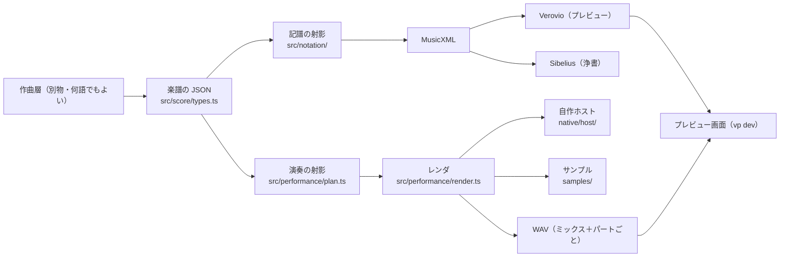

# 構成 — 鳴らす仕組みと見せる仕組み

作曲層から独立した土台の、今の構成。決めた理由は各決定記録にある。

## 楽譜の JSON（作曲層との唯一の契約）

型と説明は [`../src/score/types.ts`](../src/score/types.ts)、見本は [`../examples/showcase.json`](../examples/showcase.json)。
決めた理由は [`decisions/0014`](./decisions/0014-score-json-contract.md)。

| 項目 | 表し方 |
| --- | --- |
| 時間 | 四分音符単位。数か `[分子, 分母]` の分数（例: 3連8分 = `[1, 3]`） |
| 音高 | 実音。`"E+4"`（四分音上げ）、`"B-3"`（四分音下げ）、`{ "midi": 64.5 }`、`{ "step", "alter", "octave" }`。四分音の格子のみ |
| 強弱 | 連続値。0 = niente、1 = ppp … 5 = mf … 8 = fff。パートの曲線（`dynamics`、`to: "linear"` で線形に移る）と音符の `dynamic` |
| 奏法 | 楽器ごとの語彙（[`../src/instruments/catalog.ts`](../src/instruments/catalog.ts)）。組み合わせは `+`（`"tremolo+sul-pont"`） |
| ディヴィジ | パートが `players`（そのセクションの何人か）を持つ（[`decisions/0015`](./decisions/0015-divisi-first-class.md)） |
| 拍子 | 小節ごと。`groups` で拍のまとまり（7/8 を `[2, 2, 3]`）。省くと x/4 は 1 拍ずつ、6/8・9/8・12/8 は 3 ずつ、ほかの x/8・x/16 は 2 ずつで奇数なら最後が 3 |
| テンポ | 変わる所ごと。`to: "linear"` で次の値まで徐々に変わる（accel. / rit. と書く。拍に対して直線） |
| グリッサンド | 音符の `gliss: true` で同じ声部の次の音へ滑る（その音の長さ全部をかけて）。`glissAfter` でその長さだけ保ってから滑る |
| フェザードビーム | パートの `feathers`（`at`、`dur`、`kind: "accel" \| "rit"`）。その範囲で始まる音は均等に書き、1 本の連桁を扇形に開く／閉じる。鳴るのは書いた JSON の時刻どおり |

## 記譜の射影

[`../src/notation/`](../src/notation/)。楽譜の JSON → MusicXML 4.0。

- **段の組み立て**（[`../src/notation/layout.ts`](../src/notation/layout.ts)、[`decisions/0021`](./decisions/0021-full-score-layout.md)）。
  楽譜の JSON のパートは鳴らすものの単位で、スコアの段とは一対一でない。書き出しはまず段を組み立て、それを MusicXML の part として書く:
  - 並びは慣習の順（木管 → 金管 → ティンパニと打楽器 → ハープ → ピアノ → チェレスタ → 弦）。家族ごとに太い括弧と通った小節線、同じ楽器の段とディヴィジの段は細い括弧（`square`）。
    ハープと鍵盤は波括弧だけ
  - 管の組（Fl 1.2、Ob 1.2、Cl 1.2、Bsn 1.2、Hn 1.2 と 3.4、Tpt 1.2、Tbn 1.2）は、曲全体で一段に書けるときだけ一段にする
    （連符の種類が同時に食い違う、同時に違う奏法、上下が 3 回以上入れ替わる、のどれかがあれば二段）。一段では、区間ごとに
    同じ音なら「a 2」、同じリズムなら和音、違えば二声（一人目は符尾上「1.」、二人目は下「2.」）、一人だけなら「1.」「2.」で相手の休符を隠す。
    強弱は、二人が同時に違う強弱で吹く所だけ一人目を段の上に書く
  - 弦は、セクションが二つに分かれて一段に書けるときは「div.」「unis.」で一段に、それ以外は分かれたパートごとの段にし、奏者の範囲で名前を付ける（Vln. I 1–8）。
    分かれる所に「div.」「div. a N」
  - 打楽器は Part.player でまとめる（Percussion 1: Vibraphone）。ティンパニが先頭
  - ピアノ・ハープ・チェレスタ・マリンバで段の指定がない音は、中央ハより上を上の段、下を下の段に振り分ける
  - 段の名前は英語。最初の段は正式名、二段目からは略称。移調楽器は調を名前に入れる（Clarinets 1.2 in B♭ / Cl. 1.2 (B♭)）
  - 強弱は、その段が鳴っている所にだけ書き、休みのあと入り直す所で書き直す
- Sibelius への情報: 各段に Sibelius の楽器名と MusicXML の標準の音色名（`<score-instrument>`）、オクターヴ記譜の楽器にはオクターヴだけの `<transpose>`、
  名前の ♭ ♯ は音楽記号で出す `<part-name-display>`。用紙は A2 縦・五線 6 mm・余白 30 mm（`<defaults>`）、1 ページ目に「Score in C」。
  プレビューの帯は同じ段を使う（用紙の指定は付けない）
- 小節線と拍（拍子のまとまり）で分割してタイでつなぐ。拍の中に奇数の分割があれば、その拍全体を連符にする。
  連桁も拍のまとまりごと。休符は付点を使わず、自分の長さの倍数の位置からだけつなぐ（4/4 の 2 拍目からは 4 分休符＋2 分休符）
- グリッサンドは MusicXML の `<glissando>`。フェザードビームは連桁の `fan`（Verovio は平行に描くので、プレビューでは副連桁を主連桁へ寄せて描き直す）
- テンポが徐々に変わる所には、テンポ記号の後に accel. / rit. を書く
- プレビューの帯（1 小節ずつの MusicXML）だけの扱い: 小節線をまたぐグリッサンドは両側で半分ずつ線を描く
- 1 線の打楽器譜表の音は E4 で書く（Verovio も Sibelius も線を E4 と読む。B4 で書くと Sibelius では線の上に出た）
- 二人で一段の段では、二人とも休む所の二人目の休符を隠す。段の上の文字は、同じ所に来たものを一つにする（「1. senza vib.」）
- 調号は空の `<key/>`。Sibelius はこれだけを調号なし（Open key）と読み、移調表示でも調号を付けない
- 強弱の曲線から、記号（ppp〜fff、n）とヘアピン（niente を含む）を導く
- 奏法が変わるところに文字を置く（pizz. → arco、sul pont. → ord. など）。トレモロ、フラッター、ロールは符尾の斜線
- 臨時記号は `<accidental>` に書く。小節の終わりまで効く、ふつうの規則（[`decisions/0022`](./decisions/0022-accidentals-to-the-bar.md)）。
  `Score.accidentals: "note"` にすると、その音符にだけ効く書き方（変化のない音にもナチュラル）になるが、Sibelius は `<accidental>` を読まず自分の規則で付け直す。
  四分音は小数の `<alter>`（[`decisions/0011`](./decisions/0011-quarter-tone-notation.md)）
- 総譜は実音（in C、[`decisions/0017`](./decisions/0017-score-in-c.md)）。オクターヴ記譜の楽器だけは慣例どおり
  （ピッコロ・シロフォン・チェレスタは 1 オクターヴ下、グロッケン・クロタルは 2 オクターヴ下、
  コントラバス・コントラファゴット・バスフルートは 1 オクターヴ上、コントラバスクラは 2 オクターヴ上）。
  バスクラリネットは実音のヘ音記号（高い所はト音）
- 音部記号の途中変更とオクターヴ線（8va、15ma、8vb、15mb）は自動で付ける
  （[`../src/notation/registers.ts`](../src/notation/registers.ts)。楽器ごとに使ってよい記号は楽器表にある）。
  音部記号は小節ごと、休みで区切った範囲ごとに、加線の少なさと切り替えの少なさで選ぶ。1、2 音のためには替えない。
  それでも加線が 4 本以上になる音には、3 本以内に戻す一番小さいオクターヴ線を付ける。オクターヴ線は鍵盤・ハープ・鍵盤打楽器だけ
  （ヴァイオリンは加線 6 本以上の所だけ）

## 演奏の射影とレンダ

[`../src/performance/`](../src/performance/)、BBC SO の対応表は [`../src/libraries/bbcso/map.ts`](../src/libraries/bbcso/map.ts)。

- **レーン**（音源インスタンス1つ）は「パート × 調律」。四分音は +50 セントに調律したインスタンスで鳴らす（[`decisions/0013`](./decisions/0013-quarter-tones-by-instance-tuning.md)）
- **グリッサンド**: 滑る音の連なりは、最初の音の鍵を押したまま、BBC SO の Global Tune（±36 半音）を 10 ms ごとに書き換えて鳴らす。
  そのためのレーン（`<パート>#glide<n>`）に 1 音ずつ置く（BBC SO はピッチベンドを無視する。[`research/bbcso.md`](./research/bbcso.md) §4）。
  ホストはチャンクの中で音源のパラメータを変えられ、チャンクが終わると元に戻す。和音は一番下の音だけが滑る
- フェザードビームの音は、書いた時刻ではなく JSON の時刻で鳴る
- ティンパニは BBC SO では鍵より 1 オクターヴ低く鳴るので、鍵を 12 上げて送る（`keyOffset`）
- 打楽器の奏法は別のパッチも使える（大太鼓のソフトなロールとハードスティックは Bass Drum 2）。ハープの gliss. は BBC SO の Short Gliss
- 奏法 → BBC SO の奏法パッチ。レーンで使う奏法だけを読み込み、キースイッチ 0, 1, 2… に割り当てる。
  BBC SO にない組み合わせは近いものに落とし、警告を出す
- 強弱 → CC1（50 ms ごと）とベロシティ。打楽器は Dorico の鍵盤マップ（[`research/bbcso.md`](./research/bbcso.md) §6）
- ピアノは BBC SO の Discover Piano（製品モードとマイクが他と違う。[`research/bbcso.md`](./research/bbcso.md)）
- 奏者数 → 1人ならソロ、2人以上はセクションを人数の比で音量を下げて鳴らす。ソロしかない楽器で2人以上なら音量を上げて警告
- `samples/<楽器 id>/[<奏法>/]` に音声ファイルがあれば、BBC SO より優先して鳴らす（[`../samples/README.md`](../samples/README.md)）
- 1 つの BBC SO 楽器のレーンは、曲の中でその楽器に使う奏法を全部まとめて読み込む（同じ設定のレーンが音源を共有できる。
  新しい奏法を 1 つ使うと、その楽器は全部作り直しになる）

### チャンク（区間）でのレンダ

[`../src/performance/chunks.ts`](../src/performance/chunks.ts)、[`engine.ts`](../src/performance/engine.ts)、
[`../src/render/hosts.ts`](../src/render/hosts.ts)、ホストの `serve`。決めた理由は [`decisions/0018`](./decisions/0018-chunked-render-resident-host.md) と [`decisions/0019`](./decisions/0019-fixed-hosts-verified-chunks.md)。

- **チャンク**
  - レーンの音符を、鳴り始めの小節ごとにまとめたもの。スラーで次の小節へつながる所はまとめる
  - 音符は必ずどれか 1 つのチャンクに丸ごと入り、余韻ごと書き出す（−80 dBFS 未満が 250 ms 続くまで、最大 10 秒）
  - レーンの音はチャンクを足すだけで、境目で切ったりつないだりしない
- **キー**
  - ホストへの依頼そのもの（音色の設定、チャンクの頭からの相対時間の MIDI、長さ）のハッシュ
  - 依頼の外で音を決めるもの（プラグインの版、パッチの版、自作サンプルの中身）も入れる
  - 何が変わったかを追いかける処理はない。途中に小節を足しても、後ろの小節の中身が同じならキーも同じで、作り直さない。
    ただし挿入点をまたぐ強弱の線は伸びるので、その範囲は作り直す
  - 同じ中身が曲の何か所に出てきても、レンダは 1 回
- **ホストの担当**
  - 8 プロセスが、開いている楽譜の使う音色（状態）を全部常駐させる
  - 楽器ごとにまとめ（調律違いは同じプロセス）、仕事の量で割り振る。1 楽器が全体の 1/8 を超えるなら、複数のプロセスに置く
  - 置いた楽器は動かさない。楽器の音色の組が変わったら（新しい奏法など）、そのプロセスを起こし直して今の組だけを読む
  - インスタンスは 1 つずつ消さない（BBC SO は破棄で固まることがある）。捨てるときはプロセスごと
  - メモリの上限（既定 24 GB、`TAKEMITSU_HOSTS_MB`）を超えたら、それ以上は読み込まずに警告する
- **読み込みとレンダを重ねない**
  - どれかのプロセスが読み込んでいる間は、どのプロセスもレンダしない（他がレンダ中に読み込むと、BBC SO は揃う前に無音を返すことがある）
  - 読み込んだら、奏法ごとに楽譜の音で試し音を鳴らし、鳴るまで待ってからレンダを始める
- **順番**
  - チャンクが出てくる場所ごとに、再生位置から見た急ぎ具合（再生位置で鳴っているものが最初、先ほど後、もう過ぎたものは最後）を出す
  - チャンクの急ぎ具合は、出てくる場所のうち最も急ぐもの。各プロセスは、担当の音色の中で最も急ぐチャンクを 1 つずつ取る
- **確かめてから保存する**
  - ホストは作業用の場所に書き、鳴り始めごとに無音だったかを返す
  - 鳴るはずの音（奏法の音域の内で、niente でない）の鳴り始めが無音なら、保存せずにやり直す。3 回だめなら失敗として報告し、再生では無音の穴にする
  - 応答が 2 分ないホストは、固まったとみなして起こし直す
- **保存**
  - `.local/chunks/`（16bit、チャンクごとの音量で正規化）
  - 上限（既定 60 GB、`TAKEMITSU_CHUNKS_GB`）を超えたら、開いている楽譜が使わないものを古い順に消す。今の版と直前の版だけで超えたら警告する
- **答え合わせ**（[`../tools/check.ts`](../tools/check.ts)）
  - チャンク: 選んだチャンクを、他を止めて 1 つずつ新しいプロセスでレンダし直し、保存したものと比べる
  - パート: プレイヤーと同じ規則でセグメントを混ぜたものを、レーンを通しで新しいプロセスに鳴らした音と比べる
  - どちらも 50 ms ごとの音量で比べる（使い回したインスタンスではラウンドロビンが変わるので、波形では比べない）。
    `--self-test` は、単独で鳴るチャンクをわざと欠けさせて、全部見つけることを確かめる

## 楽器と奏法の足し方

作曲中に思いついたものを足す場所は、それぞれ1か所。

| 足すもの | 譜面に出す | 音を鳴らす |
| --- | --- | --- |
| 奏法 | [`../src/instruments/techniques.ts`](../src/instruments/techniques.ts) に1行（始まりと終わりの文字、符尾の斜線などの印） | `samples/<楽器>/<奏法>/` に音声ファイル。BBC SO に近い奏法があれば [`../src/libraries/bbcso/map.ts`](../src/libraries/bbcso/map.ts) で対応づけ |
| 楽器 | [`../src/instruments/catalog.ts`](../src/instruments/catalog.ts) に1行（打楽器は `perc(id, 名前, 略称)`） | `samples/<楽器>/` に音声ファイル、または `map.ts` で BBC SO のパッチに対応づけ |

登録していない奏法でも止まらない。奏法名がそのまま文字で出て、近い BBC SO の奏法で鳴り、プレビューに警告が出る。
音源のない楽器は、譜面には出て、無音で警告が出る。

## プレビュー

`vp dev` で開く（[`decisions/0016`](./decisions/0016-preview-in-browser.md)）。実装は [`../src/preview/`](../src/preview/)。

- `examples/` と `scores/`、および `PREVIEW_SCORE_DIRS`（`:` 区切り）の JSON を一覧し、保存されたら描き直す
- レンダのボタンや範囲はない。開いた楽譜と保存した楽譜は裏でレンダされる（上の「チャンクでのレンダ」）。
  画面上部の帯が曲全体で、濃い所がレンダ済み、警告色がレンダに失敗した所。帯をクリックするとそこへ移動する
- サーバは「新しいものがある」と知らせるだけで、ページが丸ごと取り直す（差分は送らない）。
  版ごとのチャンクの一覧（`/api/manifest`）と、そのどれができたか（`/api/status`）、
  小節と時刻（`/api/score`）、各小節の絵の場所（`/api/notation`）
- 保存すると、音の計画と、1 小節ずつの MusicXML（worker thread）を同時に作る。読んでいる最中の保存も、必ず読み直す
- 再生は、パートごとに 2 秒のセグメントを少し先まで取り寄せて鳴らす。セグメントはサーバがそのパートのチャンクから混ぜる
  （[`../src/performance/segments.ts`](../src/performance/segments.ts)）。名前は「どのチャンクをどこに何倍で」の一覧そのもの
  （規則は [`../src/preview/segment-contents.ts`](../src/preview/segment-contents.ts)）
- 未完成の音は鳴らさない。全パートの同じ時刻がそろってから進み、そろっていなければセグメントの境目で待つ。
  鳴らし始めと再開は、先の 3 秒がそろってから。保存すると、次の境目から新しい版になる。
  再生位置より前の小節の時刻が変わったら（テンポ、小節の挿入）、再生位置は「何小節目のどの割合」で移る
- **譜面**（[`decisions/0020`](./decisions/0020-notation-strip-on-server.md)）
  - サーバが開いている楽譜の全小節を、Verovio の worker thread（既定 4 本）で 1 小節ずつ先に描く
    （[`../src/preview/engraver.ts`](../src/preview/engraver.ts)、[`engrave.ts`](../src/preview/engrave.ts)）。
    見えている所から描く
  - 1 小節の MusicXML は、曲の中の位置によらない（小節番号は 1、頭の音部記号・拍子・楽器名は変わる所だけ）。
    小節線をまたぐタイ・スラー・8va・松葉は、描くときに小節の端までつなぐ
  - 各小節を、まず段の間を詰めて描いて、どれだけ要るかを測る。全小節を測ったら、段の間ごとに一番広い量で全小節を描き直す。
    これで小節どうしの段がそろう。測り終わるまでは、段が少しずれた絵が出る
  - 描いた絵は中身のキーで、メモリと `.local/engravings/` に覚える。同じ中身は二度描かない。
    保存しても描き直すのは中身が変わった小節だけ
  - ページは絵を並べるだけ。切れ目のない横長の 1 本（パノラマ）を横にスクロールして読む。
    左端に楽器名と今の音部記号（貼り付いたまま）、上に小節番号・練習番号・拍子・テンポ
  - ズームは絵の拡大縮小で、描き直さない。既定は Fit（全段が見える）。
    ピンチの間は画面の絵をそのまま GPU で伸縮し（CSS の transform）、指を止めたときに一度だけ並べ直す。
    指の下の点は動かない。譜面の欄の大きさが変わると（窓、メッセージ、ミキサー、一覧、全画面）並べ直す
  - 音域の外の音は色で示す（プレビューだけ。Sibelius に渡す MusicXML には色を付けない）。赤: 楽器の音域の外（カタログ）。
    橙: 楽器では出せるが BBC SO に録音がない（無音か別の音で鳴る）。警告の欄の上に色の意味が出る
  - 再生位置の線が出る。クリックでそこへ移動、線をドラッグで動かす。秒と拍はテンポ表で変換する
  - 再生中は、再生位置が左から 1/3 に来るように流れる。手でスクロールすると 3 秒は追わない
- ショートカットは画面上部と「?」の一覧にある（Space 再生、Enter / Home 先頭、←→ 小節、
  F 全画面、⌘= ⌘− ⌘0 ズーム、J 一覧、M ミキサー、K つまみ）
- **ミキサー**: 最初はたたんである（M か Show で出す）。パートごとに圧縮、フェーダー（−60〜+12 dB、ダブルクリックで 0 dB）、ミュート、ソロ（Alt+クリックでそれだけ）、メーター。
  マスターの最後には −1 dBFS のリミッターが常に入っている。楽譜の強弱とは別の、全体のバランス調整用。
  設定は楽譜ごとに `.local/mixer/<楽譜名>.json` に保存され、次に開いたときも効く
- **圧縮**は 0〜100% のつまみひとつで、しきい値（0 → −40 dB）、比率（1:1 → 8:1）、嵩上げ（自動）が連動する
  （[`../src/audio/dynamics.ts`](../src/audio/dynamics.ts)）。いま下げている量がつまみの横に出る。
  楽器ごとの基準音量の差と、広い強弱の幅を詰めて聴きやすくするためのもの
- ミキサーはブラウザでパートごとの音を混ぜるので、曲の長さによらず操作はすぐ効く
- 画面の文字は英語。見た目は白黒を基本に、色は状態（再生位置、警告、仮の値）だけに使う
- ツールバーの **Export** で、開いている楽譜を書き出す（曲は曲全体）
  - MusicXML: Sibelius で開く。中身はコマンドの [`../tools/export.ts`](../tools/export.ts) と同じ（`toMusicXml`）。
    プレビューだけの印（音域外の色、1 線譜の E4）は付かない
  - WAV: ミキサーの設定どおりに混ぜた音（[`../src/performance/render.ts`](../src/performance/render.ts) の `mixAsHeard`。
    ページのコンプレッサーと同じ曲線を [`../src/audio/dynamics.ts`](../src/audio/dynamics.ts) でオフラインにかける）。
    ページが今のミキサーの設定を送る。全チャンクのレンダが済むのを待ってから混ぜる
- **一覧**は楽譜のフォルダ（examples、scores、sketches、pieces、`PREVIEW_SCORE_DIRS`）ごとに見出しを立て、その下のフォルダを入れ子で出す。
  開け閉めはブラウザが覚えている。楽譜が 1 つだけのフォルダ（スケッチ）は、フォルダの名前でその楽譜として並ぶ

## スケッチとつまみ

アイデアを 1 つずつ試すための小さい楽譜。`sketches/<名前>/` に 1 フォルダ:

| ファイル | 中身 | 書く人 |
| --- | --- | --- |
| `sketch.ts` | `knobs`（動かせる値の宣言）と `score(values)`（楽譜の JSON を返す） | Claude |
| `values.json` | 今の値、名前を付けて保存した組、プレビューで一度でも動かしたつまみ | プレビュー |
| `<名前>.json` | 楽譜。`sketch.ts` と `values.json` から書き出す | [`../src/sketch/run.ts`](../src/sketch/run.ts) |
| `README.md` | カード: 問い、注文、仮の値、事実、聴いた感想 | Claude |

- つまみの部品はスケッチを問わず使い回す（型は [`../src/sketch/knobs.ts`](../src/sketch/knobs.ts)、描画は [`../src/preview/knobs/controls.ts`](../src/preview/knobs/controls.ts)）:
  数、音高、範囲、音域、選択肢、スイッチ、文字、フリーハンドの線（curve）、折れ線（envelope）、音高クラスの円（pitch-set）、
  倍音（partials）、重みの棒（weights）、ステップの格子（steps）、比率の帯（proportions）、平面上の点（xy）、乱数の種（seed）、
  時間軸の印（markers）、区間の帯（lanes）、音程ベクトルからの集合（vector-set）、間のセット（between-set: 定規の上の点と、一手違いのセット）、
  音の格子（lattice）、音域 × 時間の濃さ（heatmap）、
  動機（motif: 小さなピアノロール）。数のつまみは、曲の流れに従わせることもできる（下の「曲」）。
  一覧と見本は [`../sketches/ui-showcase/`](../sketches/ui-showcase/README.md)。
  どれも名前・グループ・意図（何を変えるためのつまみか。欄では名前に重ねると出る）を持つ。
  **つまみはアイデアを形づくる判断ごとに置く。**コードの中の数を機械的に全部出さない。足りなければ余湖さんが言い、足す
- プレビューで開くと右につまみの欄が出る（K か Knobs で隠す。左端をドラッグで幅を変えられ、ブラウザが覚える）。1 行 1 つまみ。
  行に重ねると、何のためのつまみかと使い方が出る。値を確定すると（ドラッグを離す、Enter、欄を出る、選ぶ）、
  サーバが `values.json` を書き換え、別の Node プロセスで `sketch.ts` を走らせて楽譜を書き直す（[`../src/preview/sketches.ts`](../src/preview/sketches.ts)）。
  あとはふつうの保存と同じで、変わった小節と区間だけが描き直され、再生位置はそのまま
- `sketch.ts` を保存しても、同じように書き直す
- スケッチが失敗したら（読めない音高など）つまみの欄にそのメッセージが出て、楽譜は前のまま
- まだプレビューで動かしていないつまみには橙の点が付く（provisional）。僕が置いた値で、余湖さんが決めた値ではない。
  保存した組を呼び出すと、その組で僕の値と違うものは点が消える
- 保存した組（上に並ぶ札。+ Save で名前を付ける）を押すとその値に戻る。同じ値の楽譜は保存場所に音があるので、すぐ鳴る
- `values.json` も楽譜も git に入れる

## 曲（スケッチの入れ子）

短いアイデアを並べるとパッチワークになる（スケッチがそれぞれ閉じた箱で、時間・奏者・素材を自分で決め、前後も隣も知らない）。
それを越えるために、曲をスケッチの入れ子として組む（[`../src/sketch/nest.ts`](../src/sketch/nest.ts)）。Max のパッチの中にパッチを置くのと同じ形。

- `pieces/<名前>/` が 1 曲。フォルダが**ノード**で、`sketch.ts` を持つ下のフォルダがその子（セクション、その中のブロック…何段でも）。
  各ノードに自分の `values.json`（つまみの値・保存した組）。楽譜は曲のフォルダに 1 つだけ書く
- ノードの `score(values, ctx)` は自分の時間（0 = 自分の始まり）で書き、`Fragment`（奏者ごとの音と強弱、終わった時の状態、使った動機の形、印）を返す。
  親は `ctx.child(名前, { at, length, centre?, prev?, params? })` で子を置き、`ctx.merge([...])` でまとめる。一番上は `ctx.score(...)` で楽譜にする
- **親から子へ渡るもの**（`ctx`）: 置かれた時間、曲全体の**流れ**（`ctx.flow(名前, t)`。曲がつまみで描く 0〜1 の線）、**素材**（`ctx.material.motif`）、
  奏者（`ctx.ensemble`）、**中心**（`ctx.centre`: 動機から何半音か）、前のノードが残したもの（`ctx.prev`: 奏者ごとの最後の音）、兄弟の印など（`ctx.params`）
- **子から親へ返るもの**: 音、終わりの状態（次のノードの `prev`）、印（旋律の段の始まり、カデンツ、頂点。その時の和声の位置 `shift` 付き）。
  例: 呈示部は主題の印をハープに渡し、ハープは旋律の各段の和声で鳴る
- テンポと拍子は一番上がまとめて持つ。重ねても拍の格子がずれない
- 2 つのノードが同じ奏者に同時に音を書くと、まとめる時に見つけて地図の下に出す（`outline.warnings`）
- **素材**は動機 1 つ（[`../src/sketch/motif.ts`](../src/sketch/motif.ts)）。形（P・I・R・RI）、移高、拡大・縮小、音程の伸縮（四分音も）、
  頭・尻尾、回転、音域への収め方。形は反行・逆行を通して追う（地図の色）
- **生成器**（[`../generators/`](../generators/README.md)）は曲をまたいで使う振る舞い（Max の abstraction）。
  ブロックの `sketch.ts` は生成器を奏者と既定値で呼ぶだけ（`export const { knobs, score } = statement(ensemble, { by: "Clarinet", … })`）。
  生成器を直すと、使っている曲が全部変わる。曲の中で独り立ちさせたくなったら、ブロックの `sketch.ts` に写して書き換える
- **流れに従うつまみ**: 数のつまみに `follow: true` を付けると、固定の値のほか、曲の流れ（intensity など）か、ブロックの長さにわたる直線（ramp）に従わせられる。
  値は `{ follow, from, to }`（流れの 0 で from、1 で to）。生成器は `ctx.value(v.名前, t)` で読む。欄では ∿ を押して選ぶ
- **流れの線**は折れ線のつまみに `guides`（セクションの名前）を付けて描く。セクションごとに同じ幅で描き、実際の長さに合わせて伸び縮みする
  （`formCurve`）。セクションの長さを変えても、頂点はそのセクションに付いてくる
- **動機のつまみ**（motif）: 小さなピアノロールに音を置く。曲の全部がこれから作られる
- 書き出すと楽譜の JSON に `outline` が付く（各ノードの時間、深さ、使った形、奏者、流れの線、警告）。記譜と再生は読まない
- プレビュー:
  - 一覧の PIECES に曲のノードが時間順の入れ子で並ぶ。どれを押しても曲の楽譜が開き、右にそのノードのつまみが出る
  - つまみの欄の上に、曲からそのノードまでの道（押すとそこへ）と**地図**（全ノードを時間軸に並べ、動機の形で色分け、後ろに流れ、再生位置）。
    地図のノードを押すと、そのノードのつまみに移り、再生位置がそこへ飛ぶ
  - 選んだノードの時間は楽譜に薄く影を付ける
  - アドレスに開いているノードが入る（`#score=…&node=climax/field`）。再読み込みで戻る
- どのノードのつまみを変えても、曲全体を書き直す（別プロセス。2 分の曲で 0.2 秒ほど）。生成器や曲のフォルダの `.ts` を保存しても同じ
- 1 曲目: [`../pieces/pilot/`](../pieces/pilot/README.md)（2 分、8 人）
- 2 曲目: [`../pieces/trial/`](../pieces/trial/README.md)（仮の一曲。12 分、応募要項の上限の編成）。素材は動機ではなく間のセットと中心音の和音で、
  `ctx.material.trial` に入れて渡す。一番上が先にセクションの境目（奏者ごとに次へ移るタイミング）を決め、各セクションは渡されたタイミングのあいだを書き、
  自分が実際に移ったタイミングを印（`out:<奏者>`）で返す。線を書く部品は曲のフォルダの [`engine.ts`](../pieces/trial/engine.ts)

## 手元での動かし方

コマンドは [`commands.md`](./commands.md) にまとめてある（準備、プレビュー、20 分のダミー曲、書き出し、答え合わせ、ベンチ、環境変数、溜まるものの消し方）。

BBC SO の実測と道具は [`research/bbcso.md`](./research/bbcso.md)（`tools/bbcso-probe.ts`、`tools/bbcso-summary.ts`）。
