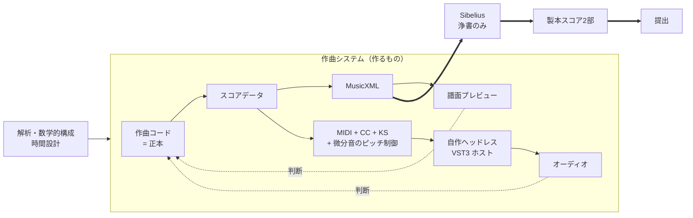
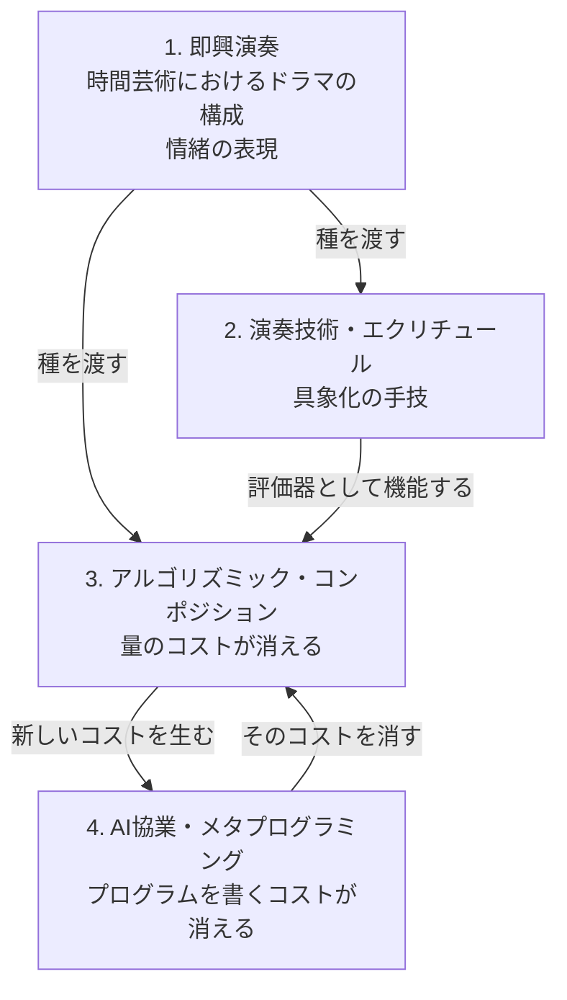
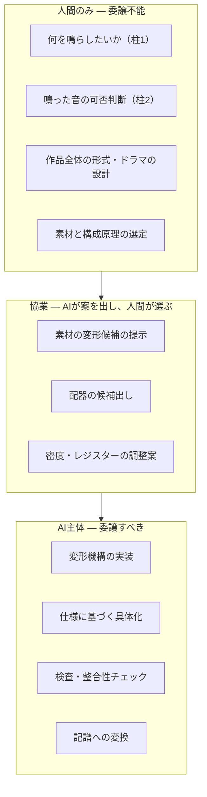
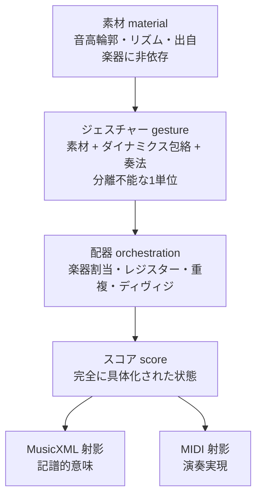
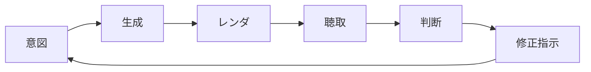
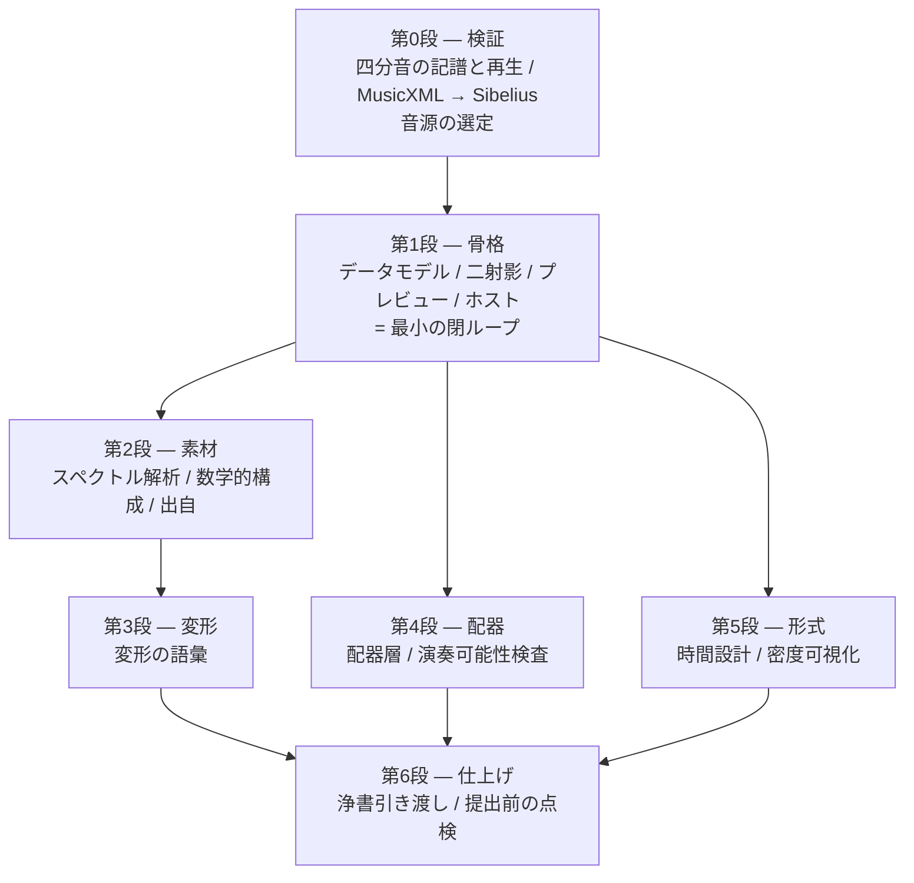

# 提案 — 2027年度武満徹作曲賞のための作曲システム

この文書は**提案**であり、全体が合意された決定ではない。
確定した項目は [`decisions/`](./decisions/) に `採用` として分離してある。
単体で読めるように書いてある。事前の会話を知らなくても、これだけで全体が分かる。

細部の正本は別ファイルにある。応募規定は [`competition.md`](./competition.md)、
賞そのものの調査は [`research/takemitsu-award-2027.md`](./research/takemitsu-award-2027.md)、
未決事項は [`open-questions.md`](./open-questions.md)。

**この文書は工数・期間を検討材料に入れていない。**
何を削るかは余湖さんが決めることであり、削られる前の全体像をここに置く。

---

## 目次

1. [全体像](#1-全体像)
2. [作曲行為の定義](#2-作曲行為の定義)
3. [AIとの境界](#3-aiとの境界)
4. [システム構成](#4-システム構成)
5. [なぜこれが高速イテレーションになるのか](#5-なぜこれが高速イテレーションになるのか)
6. [「機械が作ったゴミ」に見えないために](#6-機械が作ったゴミに見えないために)
7. [開発のステップ](#7-開発のステップ)
8. [リスク](#8-リスク)

---

# 1. 全体像

## 作るもの

**2027年度武満徹作曲賞に応募する1曲を書くための、専用の作曲システム。**

汎用の作曲環境ではない。この1曲のために作り、この1曲の要求に最適化する。
汎用性は目的ではなく、必要になった箇所にだけ後から生える。

## 作品の性格

作曲上の与件として決まっていること。

- **四分音までを使う。** これがシステム全体の設計を支配する
  （[`decisions/0008`](./decisions/0008-quarter-tone-native.md)）
- スペクトル解析的なアプローチと、**限定された音程を組み合わせで数学的に探求する**
  アプローチを想定している
- **恣意的なメロディを入力したいケースは少ない。**
  素材は解析と構成から来るのであって、即興の採譜からは来ない

この3つ目が、システムの性格を大きく決める。
素材の入口として鍵盤や録音を作り込む必要が薄く、代わりに
**解析と数学的構成をコードとして書く**ことが素材生成の中心になる。

## 工程の全体



Sibelius は**浄書専用**。作曲行為はそこでは一切行わない
（[`decisions/0003`](./decisions/0003-musicxml-one-way.md)）。
MusicXML は片道の出口であり、往復同期は要求しない。この非対称性が設計を大きく単純にする。

## 最終成果物は「紙のスコア」である

ここが全体を貫く最重要の事実で、設計の優先順位を決める。

**譜面審査は紙のスコアだけで行われる。** 音源の提出は要求されていない。
審査員ショーン・シェパードは、約110作品のスコアを自分で読んで4作品を選ぶ
（予備審査委員会は存在しない）。

したがって:

- **判定される対象は、聴こえる音ではなく、見える譜面。**
- オーディオレンダリングは**作曲者が判断を下すための装置**であって、成果物ではない。
- 譜面の読みやすさ・記譜の説得力・演奏家に向けた配慮は、
  「あとで綺麗にする作業」ではなく**審査対象そのもの**。

この事実は [6章](#6-機械が作ったゴミに見えないために)で最も強く効いてくる。

## 越えられない外形条件

詳細と提出前の点検表は [`competition.md`](./competition.md)。設計に効くものだけ挙げる。

| 条件 | 内容 |
| --- | --- |
| 演奏時間 | 10分以上20分未満 |
| 形態 | コンチェルトを除くオーケストラ作品。一人の指揮者で振れること |
| 編成上限 | 木管各3・Hr4・Tp3・Tb3・Tuba1・その他管楽器1・Hp2・**キーボード2奏者**・**打楽器4奏者（ティンパニ含む）**・弦 30/12/10/8 |
| 電子音 | リアルタイム増幅・変調は不可。フィクスト・メディア再生も不可。シンセは鍵盤奏者が弾く形でのみ可 |
| 記譜言語 | 通常の音楽用語・記号のほかは**英・仏・独・伊のみ** |
| 匿名性 | 楽譜には作品タイトルのみ。作曲者名を書かない |
| 提出後 | 変更・訂正・加筆は一切不可 |

規定違反による不受理は毎年数件発生しているが、
自動検査の仕組みは作らず、提出前の点検で担保する
（[`decisions/0009`](./decisions/0009-no-linter.md)）。

---

# 2. 作曲行為の定義

## 4本の柱の構造

余湖さんが挙げた4本の柱は、並列の要素ではなく、
**「着想から、それを聴いて判断できるまでの距離」をどう縮めてきたかの層**として読める。



- **1 は源泉であり、代替不能。** 何を鳴らしたいか、時間の中でどうドラマを組むか。
  この時点では具体的な技術は関係しない。
- **2 は最初の "How" であり、同時に評価器。** 3 の時代になっても武器としては退場せず、
  **鳴った結果を裁く耳**として最後まで残る。銃が主武器の戦場でも肉弾戦スキルが礎であるのと同じ。
- **3 は産業革命。** 単純反復の工数がリニアに増えなくなり、「譜面の量」という概念が部分的に消える。
  代わりに「アイデア1つにつきプログラム1本」という新しいコストを持ち込む。
- **4 はそのコストを消す。** 結果として、残るのは 1（何を鳴らしたいか）と 2（鳴った結果を裁く耳）になる。

この作品では素材が解析と数学的構成から来るため、**柱1は旋律の供給源としてではなく、
時間設計とドラマの側で働く。** これは柱1の定義そのもの
（「時間芸術におけるドラマの構成能力」）と矛盾しない。

## 作曲とは、判断の連鎖である

この構造から、作曲行為の定義が出る。

> **作曲とは、「鳴らしたい音楽像」と「実際に鳴った音」の距離を、繰り返し縮める行為である。**

このシステムにおいて、作曲者が実際に行う操作は次の4つに還元される。

| 操作 | 柱 | 委譲可能か |
| --- | --- | --- |
| 鳴らしたい像を出す | 1 | **不可** |
| 鳴った音を聴いて可否を判断する | 2 | **不可** |
| 判断を修正指示に翻訳する | 2→3 | 部分的に可 |
| 修正指示を実現する機構を作る | 3→4 | **可（AIの主戦場）** |

**音符を1つずつ入力する行為は、この定義のどこにも現れない。**
それは「修正指示を実現する」の最も原始的な実装形態にすぎず、4 によって置き換えられる対象。

## 高品質再生は贅沢ではなく、認識論的な必要条件

この定義から、余湖さんが「ここの設計が超1番重要」と言った理由が形式的に説明できる。

作曲が判断の連鎖であるなら、**判断の質はシステムの出力の質を直接規定する**。
そして判断は、聴こえた音に対して下される。

粗い MIDI モックアップで判断すると、**誤った判断が下される**。
そして誤った判断はそのまま浄書され、提出される。
音色が痩せていれば厚く書きすぎ、アタックが均質なら発音の差異を作り込まず、
残響がなければ空間の設計を誤る。

四分音を使う以上、これはさらに深刻になる。
**音源が四分音を出せなければ、レンダリングは作品とは別の音を鳴らすことになり、
判断装置として機能しない。** 音源選定の第一条件がここから出る。

したがって再生品質は「あると嬉しい機能」ではなく、判断が正しくなるための前提条件であり、
システムの中で最も高い優先度を持つ。**即時プレビューを持たないのも同じ理由**で、
判断に足る音でしか判断しない。

---

# 3. AIとの境界

## 委譲の三層



## 境界の原則

**「AIは決めない」ではなく、「AIは人間が書いた仕様の内側で決める」。**

AIが和音のヴォイシングを決めるのは構わない。作曲者がレジスターと密度と機能を
指定した上での具体化だからだ。AIが決めてはいけないのは、
**その和音がそこに存在すべきかどうか**であり、**次に何が起こるべきか**である。

判定の基準は「決定の可逆性と従属性」に置く。

| 委譲してよい判断 | 委譲してはいけない判断 |
| --- | --- |
| 仕様の内側にある | 仕様そのものを定める |
| 可逆で、聴いて棄却できる | 一度入ると全体を規定する |
| 局所的 | 大域的な形式に関わる |

## 声の統一性を守るための規律

ここが最大の危険で、6章と直結する。

**局所的に良い提案を多数採用すると、全体として声が失われる。**
それぞれの箇所は上手いのに、作品全体としては誰が書いたのか分からなくなる。
これは審査員が繰り返し指摘している落選の典型そのものである
（[6.1節](#61-審査員が繰り返し指摘していること)）。

対策として、次の3つの規律を提案する。

### 規律1 — 素材の出自を記録する

スコア上のすべてのジェスチャーは、**何に由来し、どの変形を経てここに来たか**を保持する。

この作品では素材が解析と数学的構成から来るため、出自は
「どの即興か」ではなく**「どの解析・どの構成原理・どのパラメータか」**になる。

```
gesture#127
  ← thin(0.6) ← register(+2oct) ← subset{0,3,7,10}
  ← spectral-analysis "bell-04" の部分音 3,5,8,13
```

これによって「この曲の音は、選んだ構成原理から一貫して導かれているか、
それとも途中で無関係な発明が混ざっているか」を**機械的に監査できる**。

出自を持たないジェスチャーが増えていたら、それは危険信号として検出できる。

> **注意:** 素材が数学的に導かれる以上、出自の記録だけでは
> 「個人の声」の担保にならない。声がどこに宿るかは未決の論点
> （[`open-questions.md` Q13](./open-questions.md#q13)）。

### 規律2 — 聴かずに書かない

**一度も聴いていない素材をスコアに入れない。**
AI が生成し、譜面上は妥当に見え、しかし誰も鳴らして確かめていない小節が、
最も危険な負債になる。

システム側でこれを支援できる。各ジェスチャーに「聴取済み」フラグを持たせ、
未聴取の領域をプレビュー上で可視化する。

### 規律3 — 形式は手で引く

作品の大きな時間設計（ドラマの曲線）は、**生成の前に人間が引く**。
アルゴリズムはその曲線の内側でのみ働く。

これは柱1の定義そのものであり、アルゴリズムに最も欠けている能力でもある。
生成器には「到達」の感覚がない。

**素材が数学的に導かれる作品では、この規律の重要度がさらに上がる。**
作曲者の判断が最も濃く現れる場所が形式の側になるため。

## AIが最も価値を出す場所

逆に、AIに全面的に任せるべき領域を明確にしておく。

- **変形機構の実装**（柱3のコストそのもの）。「この音型を、こういう規則で薄くしたい」を
  コードにする作業。ここが4本目の柱の存在理由。
- **大量の候補生成**。同じ素材の配器違いを30通り作る、といった作業。
  人間は聴いて選ぶだけになる。
- **機械的検査**。音域外、演奏不能な速度、ミュート交換の時間不足。
  人間が見落とす種類の誤りを網羅的に潰す。
- **記譜への変換**。ジェスチャーから MusicXML への射影は純粋に技術的な作業。

---

# 4. システム構成

## 4.1 データモデル — プリミティブを「音符」ではなく「ジェスチャー」にする

強弱・エクスプレッション・奏法を一級市民として扱うという要求は、
**データモデルの選択で決まってしまう**（[`decisions/0005`](./decisions/0005-gesture-as-primitive.md)）。

素朴に作ると「音符の配列 + 後付けのアノテーション層」になる。
この構造では強弱が構造的に二級市民になる。音符を消しても強弱が残り、
AIに「このフレーズをもっと切迫させて」と言っても音高しか動かない。

提案する構造は4層。



### なぜジェスチャーを単位にするか

**1つのジェスチャーが、音高の輪郭・リズム・ダイナミクスの包絡・奏法を、
分離不能な一つの単位として持つ。** 強弱は音符に付ける属性ではなく、
ジェスチャーのアイデンティティの一部として最初から入っている。

これが4本の柱すべてに同時に効く。

- **柱1**: 発想が「形をもった身振り」なので、モデルが発想の形と一致する
- **柱2**: 「この身振りはこの奏法・この強弱で成立するか」という、判断の自然な単位になる
- **柱3**: 変形操作がジェスチャー単位で書ける
- **柱4**: AIに「もっと切迫させて」と言ったとき、**包絡と奏法と音高が一緒に動く**

### なぜ配器を分離するか

素材は楽器から独立して存在し、「誰に、どのレジスターで、何本で、ディヴィジで」
割り当てるのが別の変換になる。

- アルゴリズム的な配器が可能になる
- **同じ素材の配器違いを一晩で何通りも聴き比べられる**
- シェパード自身の作曲実践（音色が形式を動かす）とも噛み合う

### 音高の表現

**半音単位の整数を使わない**（[`decisions/0008`](./decisions/0008-quarter-tone-native.md)）。
四分音は例外ではなく常用されるため、例外処理にすると例外のほうが多数になる。

具体的な形式（セント値 / 有理数 / 24平均律の整数 / その他）は未決
（[`open-questions.md` Q6](./open-questions.md#q6)）。
**この選択は全層に波及するので、最初に決める必要がある。**

## 4.2 二つの射影と、演奏マップ

スコアデータから出る先は二つあり、要求が本質的に違う。

| | MusicXML 側 | MIDI 側 |
| --- | --- | --- |
| 必要なもの | 記譜的**意味** | 演奏の**実現** |
| 強弱 | `mp`、ヘアピン `<`、楽語 `cresc.` | ベロシティ + CC1/CC11 のカーブ |
| 奏法 | テキスト `sul pont.`、記号 | **キースイッチ**（演奏音域外のノート） |
| 打楽器 | 譜表位置 + 符頭 + 楽器参照 | 音源固有のノートマッピング |
| **四分音** | 臨時記号（`quarter-sharp` 等） | **ピッチベンド / MTS-ESP / Scala / MPE** |
| 時間 | 拍・小節・テンポ記号 | 絶対時刻 |

この二つは 1:1 に対応しない。`cresc.` は片方では記号ひとつ、
もう片方では N 拍にわたる CC ランプになる。

**この非対称を吸収する唯一の可変部品が「演奏マップ」**であり、
キースイッチも打楽器マッピングも CC の流儀も四分音の出し方も、全部ここに閉じ込める。

演奏マップは**音源ライブラリごと・楽器ごと**に必要になる。
規模は `使用楽器数 × 使用奏法数`。

四分音をピッチベンドで実現する場合、**1ノート1MIDIチャンネル**の割り当て管理が要る。
楽器数 × ポリフォニーでチャンネルが枯渇しうるため、
ここは自作ホスト（[4.4節](#44-vst-ホスティング)）と一体で設計する。

## 4.3 アプリケーションの形態 — 選択肢

即時プレビューを持たないため、ブラウザ内で音を鳴らす必要はない。
レンダリングは外部プロセスが行い、UI は結果のファイルを再生するだけになる。

| 案 | 中身 | 効いてくること |
| --- | --- | --- |
| **A. Vite dev server + ブラウザ** | 作曲コードを保存するとプレビューが更新される。シェルを持たない | 立ち上がりが最短。ホストの起動はブラウザからは直接できず、別の経路が要る |
| **B. Electron** | Web UI + メインプロセスがネイティブ側を持つ | **メインプロセスから自作ホストを直接起動できる。**ファイル監視・レンダリング制御を一箇所に置ける。パッケージングの作業が発生する |
| **C. Tauri** | Web UI + Rust バックエンド | Electron より軽い |
| **D. VS Code 拡張** | エディタの中にプレビューを出す | 作曲コードを書く場所と聴く場所が同一になる。UI の自由度は落ちる |
| **E. ネイティブアプリ（JUCE）** | すべて C++ | 音の経路が最短。UI の作り込みが最も重い |

A と B は排他ではなく**移行経路**。A で立ち上げて B に包むことができる。

Web ベースであることは合意している。理由は、
譜面プレビュー・密度可視化といった **UI を作り込んでいく余地が
このプロジェクトの中心にあるから**で、そこは Web が最も強い。

## 4.4 VST ホスティング

**Chromium の中に VST3 はロードできない。** ここだけは必ずネイティブのプロセスが要る。

**決定: ヘッドレスの VST3 ホスト CLI を C++ / JUCE で自作する。**
検討した選択肢（Reaper / Carla / pedalboard / 自作 / Rust）と決定の理由は
[`decisions/0007`](./decisions/0007-own-headless-host.md)。

要点は2つ。**購入も学習も余湖さんに要求しない**こと。そして
**四分音のためのピッチベンドと MIDI チャンネル割り当てを、こちらが完全に制御できる**こと。
既存の DAW やホストに載せると、この層に手が届かないか回り道が要る。

ホストの役割:

- プラグインをロードし、保存されたプラグイン状態を適用する
- MIDI（ピッチベンドとチャンネル割り当てを含む）を流す
- 指定範囲をオフラインでレンダリングし、WAV を書き出す
- 楽器ごとのステムを個別に出力できる
- 楽器の初期設定用に、エディタを開いてプラグイン状態を保存するモードを持つ

## 4.5 譜面プレビュー — 選択肢

**四分音の臨時記号を描けることが選定条件に加わる。**

| 案 | 中身 | 効いてくること |
| --- | --- | --- |
| **Verovio** | WASM。MusicXML / MEI を直接読んで浄書品質でレンダリング | 品質が高い。**Sibelius に渡すのと同じ MusicXML をそのまま食わせられる** |
| **OpenSheetMusicDisplay** | MusicXML → VexFlow | 対話機能（カーソル追従など）を作りやすい |
| **VexFlow** | 低レベルの描画 API | 完全な制御。MusicXML の解釈を自前で持つ必要がある |
| **MuseScore CLI** | MusicXML → SVG/PNG をヘッドレスで変換 | **Sibelius とは別の実装による第二の検証**として使える |
| **自前 SVG 生成** | スコアデータから直接描く | 完全な自由。浄書の質を自分で作ることになる |

> **提案: プレビューに MusicXML を食わせて、輸出の検証を兼ねさせる。**
> こうするとプレビューが「今どう鳴るか」を見せると同時に、
> **MusicXML に何が乗っていて何が落ちているかを常時検査**してくれる。
> ヘアピンが出ていない、奏法テキストが消えている、四分音の臨時記号が化けている、
> といった事故を Sibelius を開く前に発見できる。
>
> ただし Verovio のレンダリングと Sibelius のレンダリングは別物なので、
> **「内容が乗っているか」の検証にはなるが「見た目がどうなるか」の保証にはならない。**

## 4.6 可視化 — 音楽の質を測るための計器

ピアノロールは既存ライブラリが DAW 形状に最適化されていてジェスチャーモデルと噛み合わないため、
自前描画（Canvas / SVG）が素直だと考える。

そして**ピアノロール以上に価値が高い可視化**があると思っている。

| 可視化 | 何が見えるか | なぜ効くか |
| --- | --- | --- |
| **密度曲線** | 時間軸に対する、鳴っている奏者数・音数 | 審査員が最も批判する「一様に高い密度」を**目で検出できる** |
| **レジスター占有図** | 時間 × 音域の占有 | 全音域を常に埋めている状態を検出できる |
| **奏者稼働マップ** | 誰がいつ休んでいるか | 「全員が常時鳴っている」を検出できる。ターネジが名指しで批判した状態 |
| **奏法分布** | どの奏法がどこで使われているか | 語彙が実際に使い分けられているかを確認できる |
| **出自マップ** | 各ジェスチャーがどの構成原理由来か | [規律1](#規律1--素材の出自を記録する)の監査 |
| **未聴取領域** | まだ鳴らして確かめていない箇所 | [規律2](#規律2--聴かずに書かない)の担保 |
| **打楽器奏者の動線** | 4人がいつ何を叩き、持ち替えが間に合うか | 規定（4奏者）の物理的成立を確認する |

これらは「あれば便利な機能」ではなく、
**このシステムが目指す音楽の質を、作曲中に測るための計器**である。

## 4.7 素材の生成

**恣意的なメロディを入力するケースは少ない**という前提により、
素材の入口は鍵盤や録音ではなく、**コードによる解析と構成**が中心になる。

| 経路 | 中身 |
| --- | --- |
| **スペクトル解析** | 音を解析して部分音の構造を取り出し、音高素材にする |
| **数学的構成** | 限定された音程集合を組み合わせで探索し、素材を導く |
| 言葉で書く | 「上行して、途中で息が詰まって、崩れる」のような記述から具体化する |
| 図形で描く | 輪郭・包絡を直接描く |
| MIDI 鍵盤から録る | 弾いた結果を素材にする |

上2つが主経路になる。下3つは必要になったら足せばよく、
**どの経路で入っても同じジェスチャー表現に落ちる**構造にしておけばよい。

スペクトル解析を素材の源にするなら、**解析対象の音の選定が
作曲上の重要な判断になる**（何を解析するか＝何を素材にするか）。

## 4.8 規定への適合

**自動検査の仕組みは作らない**（[`decisions/0009`](./decisions/0009-no-linter.md)）。
提出は1回しかない事象であり、常時動く検査機構は過剰。

代わりに [`competition.md` の点検表](./competition.md#提出前の点検表)を、
**浄書に入る前**と**最終稿の完成時**の2回、人間と Claude で通す。

ただし編成の上限（打楽器4奏者、キーボード2奏者）は
作曲中に常に意識しておく必要がある。機械が教えてくれない。

---

# 5. なぜこれが高速イテレーションになるのか

## ループの解剖



作曲の速度は「1周の時間」ד周回数"ではなく、
**「単位時間あたりに下せる、質の高い判断の数」**で決まる。
各段階を個別に速くする。

## 高速化する要素

### 1. 正本がコードであること

[`decisions/0002`](./decisions/0002-code-as-source-of-truth.md)。

- AI が**編集主体として対等に入れる**。GUI 状態が正本だと AI は操作の代行しかできない
- diff が意味を持つ。何を変えたかが読める
- git がそのまま音楽のバージョン管理になる

### 2. 部分レンダリング

**15分のオーケストラ全体を毎回レンダリングしていては話にならない。**
「小節45〜72を、この配器で鳴らす」が1操作で完結する必要がある。

これは高速化の中で最も効く一手だと考えている。作曲の実作業は
30秒〜1分の断片に対して行われるので、その単位でレンダできるかどうかが
イテレーション速度をほぼ決める。

### 3. 変形の語彙

速度は「AIに何を言えるか」の語彙の豊かさから来る。
ジェスチャーに対して適用できる動詞を揃えておく。

移高／反行／逆行／拡大・縮小／間引き／充填／再配器／再奏法づけ／
包絡の差し替え／密度の変更／レジスターの移動／時間軸の伸縮／断片化／連結

**これらが揃っていると、「こうしたい」と「そうなった」の間の距離が一語になる。**

### 4. A/B 比較と分岐の保存

複数の版を同時に生かしておき、切り替えて聴き比べる。
git のブランチが音楽的な選択肢の枝になる。

**捨てた案が失われないことが、大胆な試行を可能にする。**
これは6章の「驚き」の要求と直結する。安全に戻れるからこそ、危険な手が打てる。

### 5. 機械的検査の即時性

音域外、演奏不能な速度を、保存のたびに検出する。
**人間が検査に使う時間がゼロになる。**

## 何が速度を殺すか

正直に、逆側も挙げる。

- **演奏マップの整備**は初回に必ずかかるコストで、ここは自動化しにくい
- **四分音の実現方式**が決まるまで、MIDI 射影の設計が確定しない
- **MusicXML → Sibelius の相性問題**は、発見が遅れるほど手戻りが大きい
- **レンダの待ち時間**は部分レンダで軽減できるが、ゼロにはならない
- **聴取そのもの**は実時間でしか進まない。ここだけは原理的に短縮できない

最後の項目が重要で、**聴く時間が作曲時間の下限を決める**。
システムが最適化できるのは「聴くまで」と「聴いた後」だけ。

---

# 6. 「機械が作ったゴミ」に見えないために

## 6.1 審査員が繰り返し指摘していること

武満賞では、審査員が毎年「譜面審査を終えて」という総評を公開している。
**直近4人が、言葉は違うのにほぼ同じ診断を独立に下している。**
出典と全文は [`research/takemitsu-award-2027.md`](./research/takemitsu-award-2027.md)。

> **近藤 譲（2023年度・107作品）**
> 「私が何らかの点で惹かれたのは、**12曲ほど**であった。（略）どの作品においても、
> **現代の芸術音楽の作曲に纏わる慣例的な（常識的な）概念やメティエへの配慮が、
> その美点を曇らせ、屢々覆い隠してしまってさえいる**ようにも感じられた。」

> **マーク=アンソニー・ターネジ（2024年度・102作品）**
> 「**大編成のオーケストラが使えるからといって、奏者全員がつねに演奏すべきということではない。
> 息抜き、そして戦略的な計画が必要である。すべてのテッシトゥーラを使い、
> オーケストラのほぼ全奏者が持続的に演奏しているようなスコアは退屈だ。**」

> **ゲオルク・フリードリヒ・ハース（2025年度・137作品）**
> 「**ラディカルなことを試み、ラディカルな決断を独自に下すことができるアーティスト**を探していた。」

> **イェルク・ヴィトマン（2026年度・112作品）**
> 「応募作品の大多数は、複雑で微細に区別されたテクスチュアで展開される。これは賞賛すべきことだが、
> **逆説的に、こうした高度に作り込まれたテクスチュアの背後で、ひとりの個人、パーソナルな声、
> すなわち作品の背後にいる人間を聞き分けることが難しくなる。**（略）
> 完璧に均斉のとれた『整った』テクスチュアは見た。**でも、驚きのあるものはそれほど多くはなかった。**」

**一致点:**

1. 技術的熟達はもはや差別化要因ではない。ほとんどの応募者が高水準でオーケストレーションできている
2. 落ちる典型は「**密度が一様に高い、テクスチュア主体の、上手いが匿名的なスコア**」
3. 選ばれるのは「個人の声が聞こえる／形式と思考が明瞭／密度に緩急と風通しがある／驚きがある」もの
4. 単独審査なので、**平均点狙いは逆効果**

**ただしこれはシェパード以外の4人の言葉であり、彼が同じ基準で選ぶ保証はない。**
シェパード本人の審査方針の表明は存在せず、彼自身の譜面審査コメントが公開されるのは
2026年12月上旬（応募後）。この不確実性は消せない。

## 6.2 この作品の構想が置かれている位置 — 正直な見立て

**四分音・スペクトル的アプローチ・微分音のテクスチュアは、
ヴィトマンが批判した当のものに外形が近い。** これは直視しておく必要がある。

同時に、**両方の読みが成り立つ。**

| 読み | 内容 |
| --- | --- |
| **危険側** | スペクトル的・微分音・テクスチュア主体は、この20年で最も一般化した現代音楽の語法。「複雑で微細に区別されたテクスチュア」に外形が一致する |
| **有利側** | 「**限定された**音程を組み合わせで数学的に探求する」は、密度の高いテクスチュアとは逆。素材を絞って徹底的に扱うのは、近藤譲が評価したものであり、ターネジの言う「明瞭さ」「透明性」に近い |

決め手は**執行の仕方**にある。同じ四分音でも、
「微分音の雲を敷き詰める」のと「限定された音程関係を、聴き取れる形で提示し続ける」のとでは
譜面の見え方がまったく違う。

**後者に振ることが、この構想の勝ち筋だと考えている。**
そしてそれは、[4.6節](#46-可視化--音楽の質を測るための計器)の密度可視化で
作曲中に測れる性質でもある。

## 6.3 決定的な事実 — 判断されるのは紙である

**シェパードは録音を聴かない。スコアを読む。**

したがって「機械が作ったゴミに見えるかどうか」は、**譜面の見た目と内容の問題**である。
どれほど良い音がしても、譜面がそう見えなければ意味がなく、
逆に譜面が説得的であれば、それが評価対象になる。

生成された譜面には、読めば分かる兆候がある。

| 生成物の兆候 | 人が書いた譜面の徴 |
| --- | --- |
| 音価と密度が均質 | 密度が意図的に変化し、実際の沈黙がある |
| 強弱がテクスチュアに常に一致 | 強弱がときにテクスチュアに逆らい、フレーズを形作る |
| 奏法が区間に一律適用 | 奏法が音楽的な理由で切り替わる |
| 演奏家向けの情報がない | ブレス、ボウイング、ディヴィジ指示、譜めくりの配慮がある |
| 音域外・非現実的な跳躍・ミュート交換の時間がない | 各楽器の事情を知った上で書かれている |
| フレーズ長がグリッドに揃っている | 呼吸の単位で長さが決まっている |
| テクスチュアが薄くならない | 風通しがある |

**四分音を使う作品では、これに加えて「臨時記号の書き方が演奏者に親切か」が効く。**
四分音は読みにくいので、記譜の配慮がそのまま作曲者の実務感覚の証明になる。

## 6.4 脅威と対策

### 脅威1 — 一様な密度

審査員の批判の第一位。

**対策:** 密度を「結果として出るもの」ではなく**明示的に作曲する対象**にする。
[4.6節](#46-可視化--音楽の質を測るための計器)の**密度曲線・奏者稼働マップ**で、
作曲中に常時見えるようにする。**目で見えるものは制御できる。**

### 脅威2 — 個人の声の不在

ヴィトマンの批判の核心。素材が数学的に導かれる本作では、
特に正面から向き合う必要がある（[`open-questions.md` Q13](./open-questions.md#q13)）。

**対策:** 声は「何を素材に選んだか」「何を選ばなかったか」「どう時間に配置したか」に宿る。
つまり**構成原理の選定と、形式**。[規律3](#規律3--形式は手で引く)の重要度が上がる。

### 脅威3 — 反復の機械性

アルゴリズムの反復は厳密に同一で、人間の反復は毎回わずかに違う。

**対策:** **構造は反復してよいが、実現は反復させない。**
同じ音型が3回現れるとき、配器・強弱・奏法・微細なリズムのいずれかが必ず動く。
ジェスチャーモデルなら変形として自然に書ける。

### 脅威4 — 演奏不能・非イディオマティック

**シェパードはファゴット奏者であり、演奏家としてオーケストラの内側を知っている。**
彼はファゴットのパートを読んだ瞬間に、書き手が楽器を理解しているかどうかが分かる。

四分音を使う場合、**運指として実際に出せるか**という問題が加わる。
楽器と音域によって四分音の出しやすさは大きく違い、木管では特にそうなる。

**対策:** 機械的検査（音域、速度、ブレス、ミュート交換時間、ディヴィジ数、
打楽器の持ち替え動線、四分音の実現可能性）を持つ。
機械では見えない部分は、楽器を知っている耳で確認する。

> **これは脅威であると同時に、最大の機会でもある。**
> 審査員がファーニホウやナンカロウ型ではなく演奏家上がりであるということは、
> **演奏の現実に根ざした書き方が、確実に読み取ってもらえる**ということでもある。
> 木管、とりわけファゴットの扱いは、彼に対して最も雄弁に語りかける場所になる。

### 脅威5 — 形式の不在

生成器には「到達」の感覚がない。局所的には良く、全体としてどこにも行かない。

**対策:** [規律3](#規律3--形式は手で引く)。時間設計を、生成の前に人間が引く。

### 脅威6 — 記譜の凡庸さ

**対策:** 浄書を「あとで綺麗にする作業」と考えない。
[6.3節](#63-決定的な事実--判断されるのは紙である)の対照表の右側を、意識的に作り込む。
Sibelius への引き渡しを最後に一度だけやるのではなく、**早期から繰り返す**。

## 6.5 「驚き」をどう設計するか

ヴィトマンが名指しで欠けていると言ったもの。

これは最も設計しにくい。ただし、このシステムには構造的な有利さがある。

**版を安全に保存でき、大量の候補を短時間で聴き比べられるということは、
危険な手を打つコストが下がるということ。**
戻れないから安全策を採る、という力学が働かない。

ハースの「ラディカルな決断を独自に下せるアーティストを探していた」という言葉と、
ヴィトマンの「自分の個性が人々の気を悪くさせることを恐れず、もっと勇気をもってほしい」
という言葉は、同じことを言っている。
**このシステムの価値は、その勇気を安く買えるようにすることにある。**

---

# 7. 開発のステップ

**工数と期間を検討材料に入れていない。** 依存関係の順で並べる。



## 第0段 — 検証

**コードを書く前にやる**（[`decisions/0006`](./decisions/0006-verify-before-build.md)）。
Sibelius に何が渡るかが、システムが何を出力すべきかを決めるため。

最優先の3項目:

1. **四分音が Sibelius に渡るか。** MusicXML の四分音表現のうち、どれが生き残るか
2. **四分音が音源で鳴るか。** 選定した音源で、意図した高さが出るか
3. **打楽器が Sibelius に渡るか。** 最も崩れやすい領域

あわせて確認するもの:

- 強弱記号、ヘアピン、`cresc.` / `dim.` の楽語
- テンポ変化、アーティキュレーション
- 奏法テキスト（`sul pont.`、`col legno`、`pizz.`、ハーモニクス、ミュート等）
- 弦のディヴィジ表記、連符、装飾音、拍子の変化
- ハープ、キーボード
- **ヘッドレスホストの動作**: MIDI + キースイッチ + ピッチベンドから WAV が出るまで
- **Sibelius プラグイン（ManuScript）の要否**: 取り込み後に大量の手作業が発生する項目が
  判明した場合にのみ、その自動化を検討する。**判断はテスト結果を見てから**

## 第1段 — 骨格

**「コードを書く → 譜面が見える → オーケストラの音が鳴る」が一周する**ところまで。

- 音高表現を含むデータモデル（ジェスチャー / 配器 / スコア）
- MusicXML 射影（第0段で生き残ると分かった要素に限る）
- MIDI 射影 + 演奏マップの枠組み + 四分音のピッチ制御
- ヘッドレス VST3 ホスト
- 譜面プレビュー
- 部分レンダ（小節範囲の指定）

## 第2段 — 素材

- スペクトル解析から素材を導く経路
- 限定音程集合の組み合わせ探索
- 素材庫と、その一覧・試聴
- 出自の記録（[規律1](#規律1--素材の出自を記録する)）

## 第3段 — 変形

- 変形の語彙の実装
- AI が変形を呼び出せるインターフェース
- 候補の一括生成と比較試聴

## 第4段 — 配器

- 配器層の操作と、配器違いの一括生成
- 演奏可能性の検査（音域・速度・ブレス・ミュート交換・ディヴィジ・四分音の運指）
- 打楽器4奏者の動線検証

## 第5段 — 形式

- 時間設計（ドラマの曲線）を引く画面
- 密度曲線・レジスター占有図・奏者稼働マップ
- 未聴取領域の可視化（[規律2](#規律2--聴かずに書かない)）

## 第6段 — 仕上げ

- 浄書引き渡しの反復
- [提出前の点検](./competition.md#提出前の点検表)
- 演奏時間の確定

---

# 8. リスク

| リスク | 内容 | 効かせられる手 |
| --- | --- | --- |
| **四分音が Sibelius に渡らない** | 記譜の根幹が成立しない | 第0段で最優先に潰す。ManuScript プラグインでの補正を検討 |
| **四分音を出せる音源がない／音質が落ちる** | 判断装置として機能しなくなる | 音源選定の第一条件にする。物理モデリング系も検討 |
| **MusicXML → Sibelius の欠落** | 強弱・奏法・打楽器が落ち、手作業が爆発する | 第0段で先に潰す。プレビューに同じ MusicXML を食わせて常時検査 |
| **打楽器の記譜** | 最も崩れやすい領域。4奏者制約の物理的成立も別途必要 | 第0段で最優先。動線検証を機能として持つ |
| **MIDI チャンネルの枯渇** | ピッチベンド方式だと楽器数 × ポリフォニーで足りなくなる | 自作ホストで割り当てを設計する。チューニング標準が使えるなら回避 |
| **演奏マップの整備量** | 音源ごと・楽器ごとに必要 | 奏法の語彙を作曲上の決定として先に固定する |
| **声の統一性の喪失** | 素材が数学的に導かれる分、危険が大きい | 構成原理の選定と形式に声を宿す。Q13 で詰める |
| **外形が「よくある現代音楽」に見える** | 審査員が匿名的と評した語法に外形が近い | 限定された素材を聴き取れる形で提示する側に振る |
| **規定違反による不受理** | 毎年数件発生している | 提出前の点検を2回行う |
| **匿名性の漏れ** | スコアやメタデータに名前が残ると失格しうる | 点検表に含める |
| **提出後の修正不可** | 誤りが残ったまま確定する | 最終点検を工程として明示的に置く |
| **シェパードの基準が不明** | 彼自身の表明が存在しない | 消せない。過去4人の一致点は参考にしかならないと自覚しておく |

---

## この提案で決まっていないこと

[`open-questions.md`](./open-questions.md) にまとめてある。
とくに次の3つは、この提案の形を大きく変える。

- **Q12**: 四分音を MusicXML でどう表現し、Sibelius にどう渡すか
- **Q1**: 使用するオーケストラ音源
- **Q13**: 個人の声をどこに宿すか
