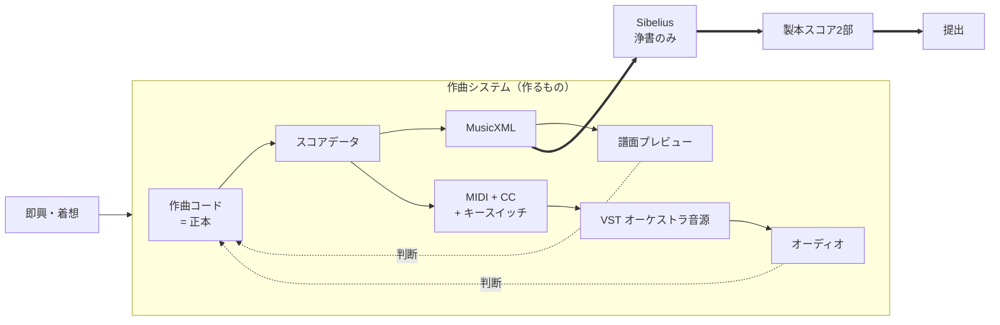
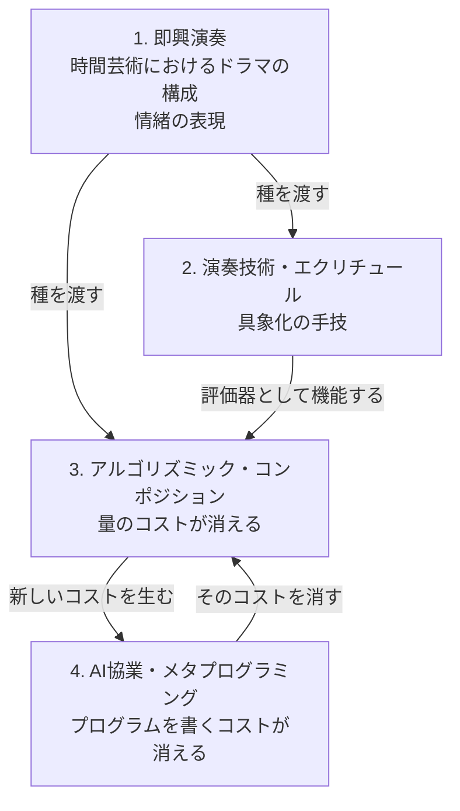
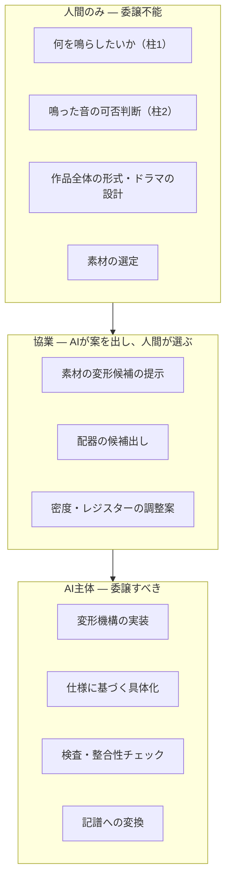
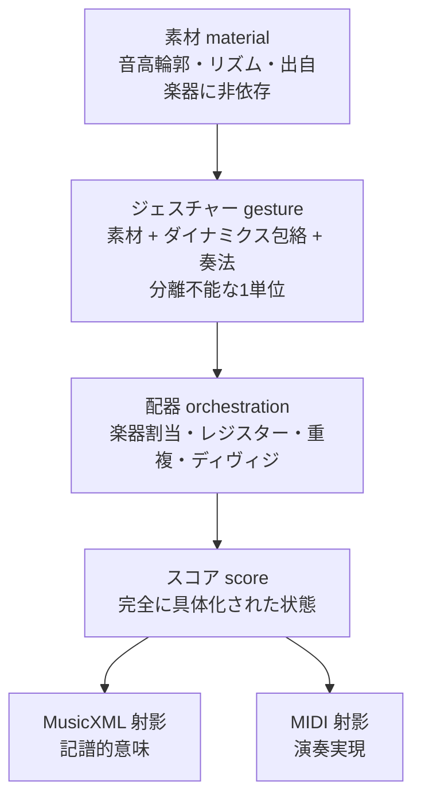
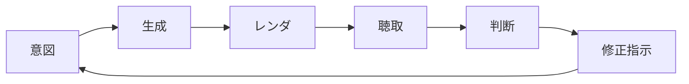
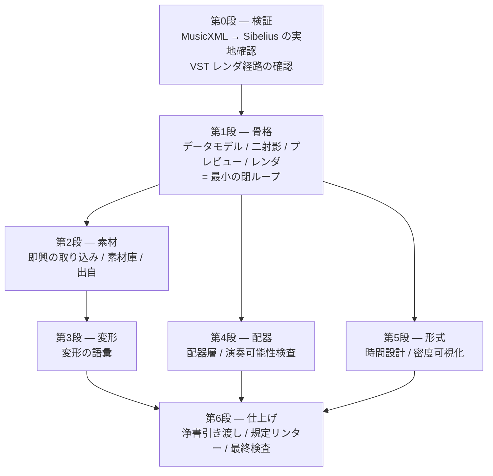

# 提案 — 2027年度武満徹作曲賞のための作曲システム

この文書は**提案**であり、合意された決定ではない。
単体で読めるように書いてある。事前の会話を知らなくても、これだけで全体が分かる。

細部の正本は別ファイルにある。応募規定は [`competition.md`](./competition.md)、
賞そのものの調査は [`research/takemitsu-award-2027.md`](./research/takemitsu-award-2027.md)、
未決事項は [`open-questions.md`](./open-questions.md)。

**この文書は工数・期間を検討材料に入れていない。**
何を削るかは余湖さんが決めることであり、削られる前の全体像をここに置く。

---

## 目次

1. [全体像](#1-全体像)
2. [作曲行為の定義](#2-作曲行為の定義)
3. [AIとの境界](#3-aiとの境界)
4. [システム構成](#4-システム構成)
5. [なぜこれが高速イテレーションになるのか](#5-なぜこれが高速イテレーションになるのか)
6. [「機械が作ったゴミ」に見えないために](#6-機械が作ったゴミに見えないために)
7. [開発のステップ](#7-開発のステップ)
8. [リスク](#8-リスク)

---

# 1. 全体像

## 作るもの

**2027年度武満徹作曲賞に応募する1曲を書くための、専用の作曲システム。**

汎用の作曲環境ではない。この1曲のために作り、この1曲の要求に最適化する。
汎用性は目的ではなく、必要になった箇所にだけ後から生える。

## 工程の全体



Sibelius は**浄書専用**。作曲行為はそこでは一切行わない。
MusicXML は片道の出口であり、往復同期は要求しない。この非対称性が設計を大きく単純にする。

## 最終成果物は「紙のスコア」である

ここが全体を貫く最重要の事実で、設計の優先順位を決める。

**譜面審査は紙のスコアだけで行われる。** 音源の提出は要求されていない。
審査員ショーン・シェパードは、約110作品のスコアを自分で読んで4作品を選ぶ
（予備審査委員会は存在しない）。

したがって:

- **判定される対象は、聴こえる音ではなく、見える譜面。**
- オーディオレンダリングは**作曲者が判断を下すための装置**であって、成果物ではない。
- 譜面の読みやすさ・記譜の説得力・演奏家に向けた配慮は、
  「あとで綺麗にする作業」ではなく**審査対象そのもの**。

この事実は [6章](#6-機械が作ったゴミに見えないために)で最も強く効いてくる。

## 越えられない外形条件

詳細は [`competition.md`](./competition.md)。設計に効くものだけ挙げる。

| 条件 | 内容 |
| --- | --- |
| 演奏時間 | 10分以上20分未満 |
| 形態 | コンチェルトを除くオーケストラ作品。一人の指揮者で振れること |
| 編成上限 | 木管各3・Hr4・Tp3・Tb3・Tuba1・その他管楽器1・Hp2・**キーボード2奏者**・**打楽器4奏者（ティンパニ含む）**・弦 30/12/10/8 |
| 電子音 | リアルタイム増幅・変調は不可。フィクスト・メディア再生も不可。シンセは鍵盤奏者が弾く形でのみ可 |
| 記譜言語 | 通常の音楽用語・記号のほかは**英・仏・独・伊のみ** |
| 匿名性 | 楽譜には作品タイトルのみ。作曲者名を書かない |
| 提出後 | 変更・訂正・加筆は一切不可 |

**規定に合致せず受理されない応募が毎年数件ある**（2026年度は116応募のうち4件が不受理）。
編成・時間・記譜言語の適合は、機械的に検査できる。
[4.8節](#48-規定リンター)でシステムの機能として組み込むことを提案する。

---

# 2. 作曲行為の定義

## 4本の柱の構造

余湖さんが挙げた4本の柱は、並列の要素ではなく、
**「着想から、それを聴いて判断できるまでの距離」をどう縮めてきたかの層**として読める。



- **1 は源泉であり、代替不能。** 何を鳴らしたいか、時間の中でどうドラマを組むか。
  この時点では具体的な技術は関係しない。
- **2 は最初の "How" であり、同時に評価器。** 3 の時代になっても武器としては退場せず、
  **鳴った結果を裁く耳**として最後まで残る。銃が主武器の戦場でも肉弾戦スキルが礎であるのと同じ。
- **3 は産業革命。** 単純反復の工数がリニアに増えなくなり、「譜面の量」という概念が部分的に消える。
  代わりに「アイデア1つにつきプログラム1本」という新しいコストを持ち込む。
- **4 はそのコストを消す。** 結果として、残るのは 1（何を鳴らしたいか）と 2（鳴った結果を裁く耳）になる。

## 作曲とは、判断の連鎖である

この構造から、作曲行為の定義が出る。

> **作曲とは、「鳴らしたい音楽像」と「実際に鳴った音」の距離を、繰り返し縮める行為である。**

このシステムにおいて、作曲者が実際に行う操作は次の4つに還元される。

| 操作 | 柱 | 委譲可能か |
| --- | --- | --- |
| 鳴らしたい像を出す | 1 | **不可** |
| 鳴った音を聴いて可否を判断する | 2 | **不可** |
| 判断を修正指示に翻訳する | 2→3 | 部分的に可 |
| 修正指示を実現する機構を作る | 3→4 | **可（AIの主戦場）** |

**音符を1つずつ入力する行為は、この定義のどこにも現れない。**
それは「修正指示を実現する」の最も原始的な実装形態にすぎず、4 によって置き換えられる対象。

## 高品質再生は贅沢ではなく、認識論的な必要条件

この定義から、余湖さんが「ここの設計が超1番重要」と言った理由が形式的に説明できる。

作曲が判断の連鎖であるなら、**判断の質はシステムの出力の質を直接規定する**。
そして判断は、聴こえた音に対して下される。

粗い MIDI モックアップで判断すると、**誤った判断が下される**。
そして誤った判断はそのまま浄書され、提出される。
音色が痩せていれば厚く書きすぎ、アタックが均質なら発音の差異を作り込まず、
残響がなければ空間の設計を誤る。

したがって**再生品質は「あると嬉しい機能」ではなく、判断が正しくなるための前提条件**であり、
システムの中で最も高い優先度を持つ。この位置づけを設計全体で保つ。

---

# 3. AIとの境界

## 委譲の三層



## 境界の原則

**「AIは決めない」ではなく、「AIは人間が書いた仕様の内側で決める」。**

AIが和音のヴォイシングを決めるのは構わない。作曲者がレジスターと密度と機能を
指定した上での具体化だからだ。AIが決めてはいけないのは、
**その和音がそこに存在すべきかどうか**であり、**次に何が起こるべきか**である。

判定の基準は「決定の可逆性と従属性」に置く。

| 委譲してよい判断 | 委譲してはいけない判断 |
| --- | --- |
| 仕様の内側にある | 仕様そのものを定める |
| 可逆で、聴いて棄却できる | 一度入ると全体を規定する |
| 局所的 | 大域的な形式に関わる |

## 声の統一性を守るための規律

ここが最大の危険で、6章と直結する。

**局所的に良い提案を多数採用すると、全体として声が失われる。**
それぞれの箇所は上手いのに、作品全体としては誰が書いたのか分からなくなる。
これは審査員が繰り返し指摘している落選の典型そのものである
（[6.1節](#61-審査員が繰り返し指摘していること)）。

対策として、次の3つの規律を提案する。

### 規律1 — 素材の出自を記録する

スコア上のすべてのジェスチャーは、**どの即興・どの着想に由来し、
どの変形を経てここに来たか**を保持する。

```
gesture#127
  ← transpose(+3) ← thin(0.6) ← invert() ← material "improv-0903-b" (小節17-20)
```

これによって「この曲は本当に自分の素材でできているか、
それともアルゴリズムが発明した音でできているか」を**機械的に監査できる**。

出自を持たないジェスチャーが増えていたら、それは危険信号として検出できる。

### 規律2 — 聴かずに書かない

**一度も聴いていない素材をスコアに入れない。**
AI が生成し、譜面上は妥当に見え、しかし誰も鳴らして確かめていない小節が、
最も危険な負債になる。

システム側でこれを支援できる。各ジェスチャーに「聴取済み」フラグを持たせ、
未聴取の領域をプレビュー上で可視化する。

### 規律3 — 形式は手で引く

作品の大きな時間設計（ドラマの曲線）は、**生成の前に人間が引く**。
アルゴリズムはその曲線の内側でのみ働く。

これは柱1の定義そのもの（「時間芸術におけるドラマの構成能力」）であり、
アルゴリズムに最も欠けている能力でもある。生成器には「到達」の感覚がない。

## AIが最も価値を出す場所

逆に、AIに全面的に任せるべき領域を明確にしておく。

- **変形機構の実装**（柱3のコストそのもの）。「この音型を、こういう規則で薄くしたい」を
  コードにする作業。ここが4本目の柱の存在理由。
- **大量の候補生成**。同じ素材の配器違いを30通り作る、といった作業。
  人間は聴いて選ぶだけになる。
- **機械的検査**。音域外、演奏不能な速度、ミュート交換の時間不足、規定違反。
  人間が見落とす種類の誤りを網羅的に潰す。
- **記譜への変換**。ジェスチャーから MusicXML への射影は純粋に技術的な作業。

---

# 4. システム構成

**この章は選択肢を絞らずに列挙する。** 何を採るかは決定の対象であり、
[`open-questions.md`](./open-questions.md) と [`decisions/`](./decisions/) で扱う。

## 4.1 データモデル — プリミティブを「音符」ではなく「ジェスチャー」にする

強弱・エクスプレッション・奏法を一級市民として扱うという要求は、
**データモデルの選択で決まってしまう**。

素朴に作ると「音符の配列 + 後付けのアノテーション層」になる。
この構造では強弱が構造的に二級市民になる。音符を消しても強弱が残り、
AIに「このフレーズをもっと切迫させて」と言っても音高しか動かない。

提案する構造は4層。



### なぜジェスチャーを単位にするか

**1つのジェスチャーが、音高の輪郭・リズム・ダイナミクスの包絡・奏法を、
分離不能な一つの単位として持つ。** 強弱は音符に付ける属性ではなく、
ジェスチャーのアイデンティティの一部として最初から入っている。

これが4本の柱すべてに同時に効く。

- **柱1**: 即興から出てくるのは音符列ではなく「形をもった身振り」なので、モデルが発想の形と一致する
- **柱2**: 「この身振りはこの奏法・この強弱で成立するか」という、判断の自然な単位になる
- **柱3**: 変形操作がジェスチャー単位で書ける
- **柱4**: AIに「もっと切迫させて」と言ったとき、**包絡と奏法と音高が一緒に動く**

### なぜ配器を分離するか

素材は楽器から独立して存在し、「誰に、どのレジスターで、何本で、ディヴィジで」
割り当てるのが別の変換になる。

- アルゴリズム的な配器が可能になる
- **同じ素材の配器違いを一晩で何通りも聴き比べられる**
- シェパード自身の作曲実践（音色が形式を動かす）とも噛み合う

## 4.2 二つの射影と、演奏マップ

スコアデータから出る先は二つあり、要求が本質的に違う。

| | MusicXML 側 | MIDI 側 |
| --- | --- | --- |
| 必要なもの | 記譜的**意味** | 演奏の**実現** |
| 強弱 | `mp`、ヘアピン `<`、楽語 `cresc.` | ベロシティ + CC1/CC11 のカーブ |
| 奏法 | テキスト `sul pont.`、記号 | **キースイッチ**（演奏音域外のノート） |
| 打楽器 | 譜表位置 + 符頭 + 楽器参照 | 音源固有のノートマッピング |
| 時間 | 拍・小節・テンポ記号 | 絶対時刻 |

この二つは 1:1 に対応しない。`cresc.` は片方では記号ひとつ、
もう片方では N 拍にわたる CC ランプになる。

**この非対称を吸収する唯一の可変部品が「演奏マップ」**であり、
キースイッチも打楽器マッピングも CC の流儀も、全部ここに閉じ込める。

演奏マップは**音源ライブラリごと・楽器ごと**に必要になる。
規模は `使用楽器数 × 使用奏法数`。

> **提案: 奏法の語彙を、作曲上の第一決定として明示的に固定する。**
> これは技術的都合ではない。限定された語彙を明確な意図で使い分けることは、
> 審査員が繰り返し批判している「一様に高密度で匿名的なスコア」の正反対にある。
> 詳細は [6.3節](#63-脅威と対策)。

## 4.3 アプリケーションの形態 — 選択肢

| 案 | 中身 | 効いてくること |
| --- | --- | --- |
| **A. Vite dev server + ブラウザ** | 作曲コードを保存するとプレビューが更新される。シェルを持たない | 立ち上がりが最短。ネイティブ機能に触れないので、VSTは外部プロセス経由になる |
| **B. Electron** | Web UI + メインプロセスがネイティブ側を持つ | **メインプロセスから VST ホストを直接叩ける**（子プロセス、または N-API ネイティブアドオン）。ファイル監視・レンダリング制御を一箇所に置ける。パッケージングの作業が発生する |
| **C. Tauri** | Web UI + Rust バックエンド | Electron より軽い。Rust 側の VST ホスティング資産は C++ に比べ薄い |
| **D. VS Code 拡張** | エディタの中にプレビューを出す | 作曲コードを書く場所と聴く場所が同一になる。UI の自由度は落ちる |
| **E. ネイティブアプリ（JUCE）** | すべて C++ | 音の経路が最短。UI の作り込みが最も重い |

A と B は排他ではなく**移行経路**。A で立ち上げて B に包むことができる。

余湖さんの当初の見立て（Web ベース）に僕も賛成する。理由は、
譜面プレビュー・ピアノロール・密度可視化といった **UI を作り込んでいく余地が
このプロジェクトの中心にあるから**で、そこは Web が最も強い。

## 4.4 VST ホスティング — 選択肢

**Chromium の中に VST3 はロードできない。** ここだけは必ずネイティブのプロセスが要る。
問いは「Web でやるか」ではなく「そのネイティブ部分を作るか、借りるか」。

### A. 既存 DAW をレンダリングエンジンとして借りる

| 案 | 中身 | 効いてくること |
| --- | --- | --- |
| A1. **Reaper** | ReaScript（Lua/Python/EEL）と CLI で完全に制御可能。テンプレートプロジェクトに音源を並べておき、MIDI を差し替えてレンダリング | スクリプト性が突出。音源選択・バランス・リバーブといった音楽的判断が余湖さんの手の届く場所に残る。オフラインレンダも実時間再生も両方できる。ライセンス費用 |
| A2. **Cubase** | 既に使っている。MIDI 取り込み → 手動レンダリング | スクリプト性が低く自動化しにくい。手作業が毎回入る |
| A3. **Bitwig** | コントローラ API はあるが用途が違う | 自動レンダリングの経路が弱い |
| A4. **Logic** | AppleScript から限定的に制御可能 | 制御の粒度が粗い |

### B. 自前の VST ホストを作る

| 案 | 中身 | 効いてくること |
| --- | --- | --- |
| B1. **JUCE でヘッドレスホスト** | `AudioPluginFormatManager` / `AudioPluginInstance` を使い、MIDI + プラグイン状態を受け取って WAV を書き出す CLI | 完全な制御。キースイッチのタイミングを厳密に扱える。楽器ごとのステム出力が自然にできる。決定論的なオフラインレンダ。**余湖さんは JUCE の資産と経験を既に持っている** |
| B2. **Rust でホスト** | `vst3-sys` / clap 系のホスト実装 | Rust で統一できる。ホスト側の資産は C++ より薄い |
| B3. **Node ネイティブアドオン (N-API)** | ホストを Node のアドオンにして Electron から直接呼ぶ | プロセス境界が消える。ビルドと配布の手間が増える |

### C. 既存のヘッドレスホストを使う

| 案 | 中身 |
| --- | --- |
| C1. **Carla** | プラグインホスト。ヘッドレスモードと Python API を持つ |
| C2. **sfizz** | SFZ 音源のライブラリ。VST ではないが、ライブラリとして組み込みやすい |

### D. VST を使わない

| 案 | 中身 | 効いてくること |
| --- | --- | --- |
| D1. **SFZ / SoundFont を自前再生** | ブラウザ内または Node 内でサンプル再生 | 経路が単純。手持ちのオーケストラ音源の品質は使えない |
| D2. **WebAudio + 軽量サンプル** | 完全にブラウザ内で完結 | 遅延ゼロ。品質は判断に足りない可能性が高い |

### E. 二段構えにする

**D2（即時・低品質）と A/B（低速・高品質）を両方持つ。**

- 構造や音高を確かめたいときは即座に鳴る軽い方で
- 音色・バランス・空間を判断するときは高品質レンダで

判断の種類によって必要な忠実度が違うので、これは妥協ではなく**適材適所**になる。

> **補足: Suara は今回の用途に向かない。**
> Suara は「Web アプリが VST になる」枠組みで、必要なのは「VST をホストする」側。
> 唯一ありうるのは「ツールを DAW 内で動かしてホスティングを DAW に委ねる」構成だが、
> PoC 段階の自作フレームワークを本番作曲に持ち込むリスクがある。この点は余湖さんと認識が一致している。

## 4.5 譜面プレビュー — 選択肢

| 案 | 中身 | 効いてくること |
| --- | --- | --- |
| **Verovio** | WASM。MusicXML / MEI を直接読んで浄書品質でレンダリング | 品質が高い。**Sibelius に渡すのと同じ MusicXML をそのまま食わせられる** |
| **OpenSheetMusicDisplay** | MusicXML → VexFlow | 対話機能（カーソル追従など）を作りやすい |
| **VexFlow** | 低レベルの描画 API | 完全な制御。MusicXML の解釈を自前で持つ必要がある |
| **MuseScore CLI** | MusicXML → SVG/PNG をヘッドレスで変換 | **Sibelius とは別の実装による第二の検証**として使える |
| **自前 SVG 生成** | スコアデータから直接描く | 完全な自由。浄書の質を自分で作ることになる |

> **提案: プレビューに MusicXML を食わせて、輸出の検証を兼ねさせる。**
> こうするとプレビューが「今どう鳴るか」を見せると同時に、
> **MusicXML に何が乗っていて何が落ちているかを常時検査**してくれる。
> ヘアピンが出ていない、奏法テキストが消えている、打楽器が化けている、
> といった事故を Sibelius を開く前に発見できる。
>
> ただし Verovio のレンダリングと Sibelius のレンダリングは別物なので、
> **「内容が乗っているか」の検証にはなるが「見た目がどうなるか」の保証にはならない。**
> 後者は実機の Sibelius で確かめる必要がある（[7章 第0段](#第0段-検証)）。

## 4.6 ピアノロールと、その他の可視化

ピアノロールは既存ライブラリが DAW 形状に最適化されていてジェスチャーモデルと噛み合わないため、
自前描画（Canvas / SVG）が素直だと考える。

そして**ピアノロール以上に価値が高い可視化**があると思っている。

| 可視化 | 何が見えるか | なぜ効くか |
| --- | --- | --- |
| **密度曲線** | 時間軸に対する、鳴っている奏者数・音数 | 審査員が最も批判する「一様に高い密度」を**目で検出できる**（[6章](#6-機械が作ったゴミに見えないために)） |
| **レジスター占有図** | 時間 × 音域の占有 | 全音域を常に埋めている状態を検出できる |
| **奏者稼働マップ** | 誰がいつ休んでいるか | 「全員が常時鳴っている」を検出できる。ターネジが名指しで批判した状態 |
| **奏法分布** | どの奏法がどこで使われているか | 語彙が実際に使い分けられているかを確認できる |
| **出自マップ** | 各ジェスチャーがどの素材由来か | [規律1](#規律1--素材の出自を記録する)の監査 |
| **未聴取領域** | まだ鳴らして確かめていない箇所 | [規律2](#規律2--聴かずに書かない)の担保 |
| **打楽器奏者の動線** | 4人がいつ何を叩き、持ち替えが間に合うか | 規定（4奏者）の物理的成立を確認する |

これらは「あれば便利な機能」ではなく、
**このシステムが目指す音楽の質を、作曲中に測るための計器**である。

## 4.7 素材の入力 — 即興をどう捕まえるか

柱1が源泉である以上、即興を素材として取り込む経路が要る。選択肢を挙げる。

| 案 | 中身 | 効いてくること |
| --- | --- | --- |
| A. MIDI キーボードから録る | 弾いた結果が直接データになる | 音高とリズムがそのまま入る。鍵盤で表せる範囲に限られる |
| B. 音声で録って解析する | 歌・身体・任意の楽器を録り、音高と包絡を抽出 | 鍵盤に縛られない。抽出の精度が問題になる |
| C. 言葉で書く | 「上行して、途中で息が詰まって、崩れる」のような記述 | 抽象的な身振りをそのまま扱える。具体化に AI が要る |
| D. 図形で描く | 輪郭・包絡を直接描く | 身振りの形をそのまま入力できる。UI の作り込みが要る |
| E. コードで書く | 直接ジェスチャーを構成する | 完全な制御。柱1の生々しさが落ちる可能性 |

これらは排他ではない。A〜E を**すべて素材の入口として持つ**ことができ、
どれで入っても同じジェスチャー表現に落ちる、という構造にできる。

## 4.8 規定リンター

規定違反による不受理は**毎年実際に発生している**（[1章](#越えられない外形条件)）。
これは機械的に完全に防げる種類の失敗なので、システムの機能として組み込むことを提案する。

保存のたびに検査する項目:

- 楽器ごとの人数が上限以内か（木管各3、Hr4、Tp3、Tb3、Tuba1、その他管楽器1、Hp2）
- **キーボードが2奏者以内か**
- **打楽器が4奏者以内か（ティンパニ含む）。かつ持ち替えが物理的に成立するか**
- 弦が 30/12/10/8 以内か
- 記譜に使われている言語が**英・仏・独・伊**のいずれかか（日本語の混入検出）
- 演奏時間が **10分以上20分未満**か（テンポマップから計算）
- スコア上に**作曲者名・個人情報が現れていないか**（匿名審査。PDF メタデータも含む）
- 楽器を損傷させる恐れのある奏法が含まれていないか（要注意リストとの照合）
- リアルタイム電子処理・フィクスト・メディアを前提とした指示が含まれていないか

---

# 5. なぜこれが高速イテレーションになるのか

## ループの解剖



作曲の速度は「1周の時間」ד周回数"ではなく、
**「単位時間あたりに下せる、質の高い判断の数」**で決まる。
各段階を個別に速くする。

## 高速化する要素

### 1. 正本がコードであること

- AI が**編集主体として対等に入れる**。GUI 状態が正本だと AI は操作の代行しかできない
- diff が意味を持つ。何を変えたかが読める
- git がそのまま音楽のバージョン管理になる

### 2. 部分レンダリング

**15分のオーケストラ全体を毎回レンダリングしていては話にならない。**
「小節45〜72を、この配器で鳴らす」が1操作で完結する必要がある。

これは高速化の中で最も効く一手だと考えている。作曲の実作業は
30秒〜1分の断片に対して行われるので、その単位でレンダできるかどうかが
イテレーション速度をほぼ決める。

### 3. 二段の聴取

[4.4節 E](#e-二段構えにする)の通り、即時・低品質と低速・高品質を両方持つ。
構造の確認に高品質レンダを待つ必要がなくなる。

### 4. 変形の語彙

速度は「AIに何を言えるか」の語彙の豊かさから来る。
ジェスチャーに対して適用できる動詞を揃えておく。

移高／反行／逆行／拡大・縮小／間引き／充填／再配器／再奏法づけ／
包絡の差し替え／密度の変更／レジスターの移動／時間軸の伸縮／断片化／連結

**これらが揃っていると、「こうしたい」と「そうなった」の間の距離が一語になる。**

### 5. A/B 比較と分岐の保存

複数の版を同時に生かしておき、瞬時に切り替えて聴き比べる。
git のブランチが音楽的な選択肢の枝になる。

**捨てた案が失われないことが、大胆な試行を可能にする。**
これは6章の「驚き」の要求と直結する。安全に戻れるからこそ、危険な手が打てる。

### 6. 機械的検査の即時性

音域外、演奏不能な速度、規定違反を、保存のたびに検出する。
**人間が検査に使う時間がゼロになる。**

## 何が速度を殺すか

正直に、逆側も挙げる。

- **演奏マップの整備**は初回に必ずかかるコストで、ここは自動化しにくい
- **MusicXML → Sibelius の相性問題**は、発見が遅れるほど手戻りが大きい
- **高品質レンダの待ち時間**は部分レンダで軽減できるが、ゼロにはならない
- **聴取そのもの**は実時間でしか進まない。ここだけは原理的に短縮できない

最後の項目が重要で、**聴く時間が作曲時間の下限を決める**。
システムが最適化できるのは「聴くまで」と「聴いた後」だけ。

---

# 6. 「機械が作ったゴミ」に見えないために

## 6.1 審査員が繰り返し指摘していること

武満賞では、審査員が毎年「譜面審査を終えて」という総評を公開している。
**直近4人が、言葉は違うのにほぼ同じ診断を独立に下している。**
出典と全文は [`research/takemitsu-award-2027.md`](./research/takemitsu-award-2027.md)。

> **近藤 譲（2023年度・107作品）**
> 「私が何らかの点で惹かれたのは、**12曲ほど**であった。（略）どの作品においても、
> **現代の芸術音楽の作曲に纏わる慣例的な（常識的な）概念やメティエへの配慮が、
> その美点を曇らせ、屢々覆い隠してしまってさえいる**ようにも感じられた。」

> **マーク=アンソニー・ターネジ（2024年度・102作品）**
> 「**大編成のオーケストラが使えるからといって、奏者全員がつねに演奏すべきということではない。
> 息抜き、そして戦略的な計画が必要である。すべてのテッシトゥーラを使い、
> オーケストラのほぼ全奏者が持続的に演奏しているようなスコアは退屈だ。**」

> **ゲオルク・フリードリヒ・ハース（2025年度・137作品）**
> 「**ラディカルなことを試み、ラディカルな決断を独自に下すことができるアーティスト**を探していた。」

> **イェルク・ヴィトマン（2026年度・112作品）**
> 「応募作品の大多数は、複雑で微細に区別されたテクスチュアで展開される。これは賞賛すべきことだが、
> **逆説的に、こうした高度に作り込まれたテクスチュアの背後で、ひとりの個人、パーソナルな声、
> すなわち作品の背後にいる人間を聞き分けることが難しくなる。**（略）
> 完璧に均斉のとれた『整った』テクスチュアは見た。**でも、驚きのあるものはそれほど多くはなかった。**」

**一致点:**

1. 技術的熟達はもはや差別化要因ではない。ほとんどの応募者が高水準でオーケストレーションできている
2. 落ちる典型は「**密度が一様に高い、テクスチュア主体の、上手いが匿名的なスコア**」
3. 選ばれるのは「個人の声が聞こえる／形式と思考が明瞭／密度に緩急と風通しがある／驚きがある」もの
4. 単独審査なので、**平均点狙いは逆効果**

**ただしこれはシェパード以外の4人の言葉であり、彼が同じ基準で選ぶ保証はない。**
シェパード本人の審査方針の表明は存在せず、彼自身の譜面審査コメントが公開されるのは
2026年12月上旬（応募後）。この不確実性は消せない。

## 6.2 決定的な事実 — 判断されるのは紙である

**シェパードは録音を聴かない。スコアを読む。**

したがって「機械が作ったゴミに見えるかどうか」は、**譜面の見た目と内容の問題**である。
どれほど良い音がしても、譜面がそう見えなければ意味がなく、
逆に譜面が説得的であれば、それが評価対象になる。

生成された譜面には、読めば分かる兆候がある。

| 生成物の兆候 | 人が書いた譜面の徴 |
| --- | --- |
| 音価と密度が均質 | 密度が意図的に変化し、実際の沈黙がある |
| 強弱がテクスチュアに常に一致 | 強弱がときにテクスチュアに逆らい、フレーズを形作る |
| 奏法が区間に一律適用 | 奏法が音楽的な理由で切り替わる |
| 演奏家向けの情報がない | ブレス、ボウイング、ディヴィジ指示、譜めくりの配慮がある |
| 音域外・非現実的な跳躍・ミュート交換の時間がない | 各楽器の事情を知った上で書かれている |
| フレーズ長がグリッドに揃っている | 呼吸の単位で長さが決まっている |
| テクスチュアが薄くならない | 風通しがある |

## 6.3 脅威と対策

### 脅威1 — 一様な密度

審査員の批判の第一位。

**対策:** 密度を「結果として出るもの」ではなく**明示的に作曲する対象**にする。
[4.6節](#46-ピアノロールと-その他の可視化)の**密度曲線・奏者稼働マップ**で、
作曲中に常時見えるようにする。**目で見えるものは制御できる。**

### 脅威2 — 個人の声の不在

ヴィトマンの批判の核心。

**対策:** [規律1（素材の出自）](#規律1--素材の出自を記録する)。
**アルゴリズムは素材を変形するのであって、素材を発明しない。**
素材は柱1（即興・着想）から来る。出自を持たないジェスチャーの比率を監査する。

### 脅威3 — 反復の機械性

アルゴリズムの反復は厳密に同一で、人間の反復は毎回わずかに違う。

**対策:** **構造は反復してよいが、実現は反復させない。**
同じ音型が3回現れるとき、配器・強弱・奏法・微細なリズムのいずれかが必ず動く。
これはジェスチャーモデルなら変形として自然に書ける。

### 脅威4 — 演奏不能・非イディオマティック

**シェパードはファゴット奏者であり、演奏家としてオーケストラの内側を知っている。**
彼はファゴットのパートを読んだ瞬間に、書き手が楽器を理解しているかどうかが分かる。

**対策:** 機械的検査（音域、速度、ブレス、ミュート交換時間、ディヴィジ数、
打楽器の持ち替え動線）を [4.8節](#48-規定リンター)と同じ仕組みに載せる。
そして機械では見えない部分は、実際に楽器を知っている耳で確認する。

> **これは脅威であると同時に、最大の機会でもある。**
> 審査員がファーニホウやナンカロウ型ではなく演奏家上がりであるということは、
> **演奏の現実に根ざした書き方が、確実に読み取ってもらえる**ということでもある。
> 木管、とりわけファゴットの扱いは、彼に対して最も雄弁に語りかける場所になる。

### 脅威5 — 形式の不在

生成器には「到達」の感覚がない。局所的には良く、全体としてどこにも行かない。

**対策:** [規律3（形式は手で引く）](#規律3--形式は手で引く)。
作品の時間設計を、生成の前に人間が引く。柱1の最も直接的な現れ。

### 脅威6 — 記譜の凡庸さ

**対策:** 浄書を「あとで綺麗にする作業」と考えない。
[6.2節](#62-決定的な事実--判断されるのは紙である)の対照表の右側を、意識的に作り込む。
Sibelius への引き渡しを最後に一度だけやるのではなく、**早期から繰り返す**。

## 6.4 「驚き」をどう設計するか

ヴィトマンが名指しで欠けていると言ったもの。

これは最も設計しにくい。ただし、このシステムには構造的な有利さがある。

**版を安全に保存でき、大量の候補を短時間で聴き比べられるということは、
危険な手を打つコストが下がるということ。**
戻れないから安全策を採る、という力学が働かない。

ハースの「ラディカルな決断を独自に下せるアーティストを探していた」という言葉と、
ヴィトマンの「自分の個性が人々の気を悪くさせることを恐れず、もっと勇気をもってほしい」
という言葉は、同じことを言っている。
**このシステムの価値は、その勇気を安く買えるようにすることにある。**

---

# 7. 開発のステップ

**工数と期間を検討材料に入れていない。** 依存関係の順で並べる。



## 第0段 — 検証

**コードを書く前にやる。Sibelius に何が渡るかが、システムが何を出力すべきかを決めるから。**
逆順にやると、作ったものを捨てることになる。

- **MusicXML の拷問テスト。** 使いそうな記譜要素を全部詰め込んだファイルを作り、
  実機の Sibelius に読ませて何が生き残るかを記録する。
  強弱記号、ヘアピン、`cresc.` の楽語、テンポ変化、アーティキュレーション、
  奏法テキスト、ミュート、弦のディヴィジ、連符、装飾音、そして**打楽器**。
- **打楽器は最大のリスク。** MusicXML の打楽器表現（`unpitched` + 表示位置 + 楽器参照）は
  複雑で、Sibelius の取り込みが崩れやすい。かつ規定で4奏者しか使えないので、
  持ち替えの物理的成立も同時に検証が要る。
- **VST レンダ経路の確認。** 手持ちの音源1つで、MIDI + キースイッチから
  WAV が出るところまでを、選んだ方式で通す。
- **Sibelius プラグイン（ManuScript）の要否判断。** 拷問テストの結果、
  取り込み後に大量の手作業が発生すると分かった項目があれば、
  それを自動化するプラグインを書く価値がある。**判断はテスト結果を見てから行う。**

## 第1段 — 骨格

**「コードを書く → 譜面が見える → オーケストラの音が鳴る」が一周する**ところまで。

- ジェスチャー / 配器 / スコアのデータモデル
- MusicXML 射影（第0段で生き残ると分かった要素に限る）
- MIDI 射影 + 演奏マップの枠組み
- 譜面プレビュー
- レンダリングの実行と再生
- 部分レンダ（小節範囲の指定）

## 第2段 — 素材

- 即興の取り込み経路（[4.7節](#47-素材の入力--即興をどう捕まえるか)から選ぶ）
- 素材庫と、その一覧・試聴
- 出自の記録（[規律1](#規律1--素材の出自を記録する)）

## 第3段 — 変形

- 変形の語彙の実装（[5章](#4-変形の語彙)）
- AI が変形を呼び出せるインターフェース
- 候補の一括生成と比較試聴

## 第4段 — 配器

- 配器層の操作と、配器違いの一括生成
- 演奏可能性の検査（音域・速度・ブレス・ミュート交換・ディヴィジ）
- 打楽器4奏者の動線検証

## 第5段 — 形式

- 時間設計（ドラマの曲線）を引く画面
- 密度曲線・レジスター占有図・奏者稼働マップ
- 未聴取領域の可視化（[規律2](#規律2--聴かずに書かない)）

## 第6段 — 仕上げ

- 規定リンター（[4.8節](#48-規定リンター)）
- 浄書引き渡しの反復
- 匿名性の最終検査（PDF メタデータ、ヘッダ・フッタ）
- 演奏時間の確定

---

# 8. リスク

| リスク | 内容 | 効かせられる手 |
| --- | --- | --- |
| **MusicXML → Sibelius の欠落** | 強弱・奏法・打楽器が落ち、手作業が爆発する | 第0段で先に潰す。プレビューに同じ MusicXML を食わせて常時検査 |
| **打楽器の記譜** | 最も崩れやすい領域。4奏者制約の物理的成立も別途必要 | 第0段で最優先。動線検証を機能として持つ |
| **演奏マップの整備量** | 音源ライブラリごと・楽器ごとに必要 | 奏法の語彙を作曲上の決定として先に固定する |
| **規定違反による不受理** | 毎年数件発生している | 規定リンターで機械的に排除 |
| **匿名性の漏れ** | スコアやメタデータに名前が残ると失格しうる | 検査項目に含め、印刷前に必ず通す |
| **声の統一性の喪失** | 局所最適な提案の集積で、誰の曲か分からなくなる | 出自の記録と監査。形式は手で引く |
| **提出後の修正不可** | 誤りが残ったまま確定する | 最終検査を工程として明示的に置く |
| **シェパードの基準が不明** | 彼自身の表明が存在しない | 消せない。過去4人の一致点は参考にしかならないと自覚しておく |
| **演奏時間の境界** | 10分未満・20分以上は失格 | テンポマップから常時計算して表示 |

---

## この提案で決まっていないこと

[`open-questions.md`](./open-questions.md) にまとめてある。
とくに次の3つは、この提案の形を大きく変える。

- 手持ちのオーケストラ音源が何か（演奏マップと再生方式の設計が全面的に依存する）
- 曲そのものの構想がどれくらいあるか（素材入力の経路の選び方が変わる）
- どの選択肢を採るか（アプリ形態・VST ホスティング・プレビュー）
